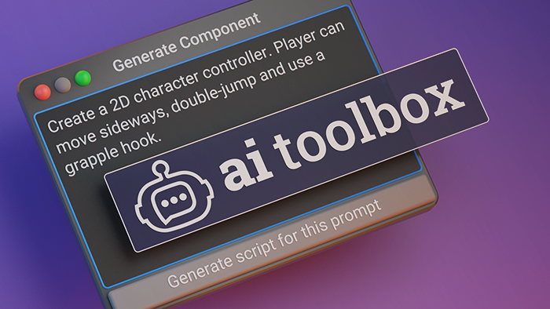

{: .image-rounded }

With {{ site.title_short }}, you can use the power of AI both in the Unity Editor and in your shipped games. It allows you to generate C# scripts from text descriptions, and generate images from text descriptions, including seamlessly tiling ones, right in your project.

## Using AI in the Unity Editor

**ChatGPT** is a powerful AI model that can generate C# scripts from text descriptions. It can be used to generate scripts for any purpose, including game mechanics, UI, and more. The generated scripts can be used as a starting point for your own scripts, or as a learning tool to understand C# and Unity concepts.

With {{ site.title_short }} you can [generate](/getting-started/#generating-a-script-with-chatgpt-prompt-window) scripts and they will be automatically integrated into your Unity Project. This streamlined process allows you to _focus on the creative aspects of your project while reducing the time spent on manual coding_.

You can also [edit](/getting-started/#editing-the-script-with-chatgpt-prompt-window) any scripts with {{ site.title_short }}, both generated and hand-written.

**DALL•E** is an advanced AI model that can generate images from text descriptions. It can be used to generate textures, UI elements, logos, reference images, and more. {{ site.title_short }} allows you to generate images from text descriptions right in your Unity project.

Using {{ site.title_short }}, you can [generate](/getting-started/#generating-images-with-dalle) images from text descriptions, including seamlessly tiling ones, right in your Unity project.

**New!** We've added experimental support for **Google Bard**. Now for any question or script you can use both ChatGPT and Bard! Check out [Bard Setup Guide](/bard-set-up/) for more details.
{:.notice--success}

## Some ways to use {{ site.title_short }}

- **Learn to Code**: Understand C# and Unity concepts through generated scripts.
- **Boost Productivity**: Speed up development with quick [script generation](/getting-started/#generating-a-script-with-chatgpt-prompt-window).
- **Starting Point**: Already know coding? Start with generated scripts as a base with boilerplate code.
- **Rapid Prototyping**: Test ideas and mechanics more efficiently.
- **Iterative Development**: Generate scripts and iterate on them as needed by [editing](/getting-started/#editing-the-script-with-chatgpt-prompt-window) with the AI.
- **Image Generation**: [Generate images](/getting-started/#generating-images-with-dalle) from text descriptions, including seamlessly tiling ones, right in your project.
- **Freeform Chat**: ask ChatGPT to explain code, how to do things in Unity or just [Chat with ChatGPT](/getting-started/#chat-with-chatgpt) about almost anything.
<!-- - **Enhance Creativity**: Explore new approaches with AI suggestions. -->

## Important Notices

This asset works with both free and paid OpenAI accounts, but we recommend checking if you have remaining OpenAI usage quota before buying. To check, please enter a prompt in the [OpenAI Playground](https://platform.openai.com/playground){:target="_blank"}. If you get an error, you probably have exhausted the free API credit and may need to purchase more in the [OpenAI Billing section](https://platform.openai.com/account/billing/overview){:target="_blank"}.
{:.notice--info}

Please be aware that AI, being an AI model, **may sometimes generate scripts that cannot be compiled** and will show errors in the Unity Console. While we strive to improve the accuracy and functionality of the generated scripts, we have no direct control over the AI's output.
{:.notice--info}

## Using ChatGPT in a game

With {{ site.title_short }}, you can use ChatGPT in your shipped games as well. It can be used for anything from NPC dialogue to generating game mechanics. Read more about the runtime usage of ChatGPT [here](/runtime/).

## Need Help?

We hope you enjoy using the {{ site.title_short }}! Please [join our community of developers](https://discord.gg/xqfh46kKfw){:target="_blank"} to share your experience and get help from other users.

If you have any questions, issues, or suggestions, please check out the following resources:
- [FAQs](/faq/) page, where the most common issues and their solutions as well as most common questions are described.
- [Contact us](/contact-details/) if you still have issues.
