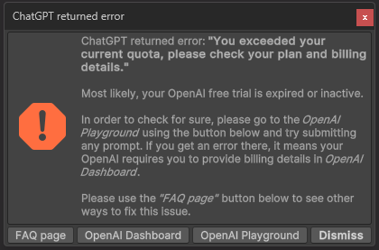

#### ChatGPT returned error: "You exceeded your current quota"

{: .image-rounded }

- Please check if any prompt on the [OpenAI Playground](https://platform.openai.com/playground) works.
- If that doesn't work, probably your free trial with OpenAI has ended and they are asking you to provide billing details on the [OpenAI Billing page](https://platform.openai.com/account/billing/overview).
- If your trial period has ended, please have a look at the answer to [`OpenAI API free trial has ended or inactive`](#openai-api-free-trial-has-ended-or-inactive).
- If you're not sure how much OpenAI's services would cost, generally it's very cheap. Most of our users spend **less than $1 per month** actively using this asset. Please check out [`How expensive is it to use {{ site.title_short }}?`](#how-expensive-is-it-to-use-ai-toolbox) for more details.

---

#### OpenAI API free trial has ended or inactive
There are multiple ways to deal with this:
- The best (and very cheap) way to fix this is to set up a paid OpenAI API account. Most of our users spend **less than $1 per month** actively using this asset. Please check out [`How expensive is it to use {{ site.title_short }}?`](#how-expensive-is-it-to-use-ai-toolbox) for more details.
- If that is not an option for you, and the trial period has ended on *all OpenAI accounts you've created*, we've added an option to use a free API server. Please check out a **Use Proxy Server** option in the {{ site.title_short }} [settings](/getting-started/#openai-api-key) for instructions.
- Another great option is using [*Google Bard*](/bard-set-up/){:target="_blank"} as the AI backend instead of ChatGPT. *Google Cloud* has a very generous sign-up bonus which is enough to generate millions of scripts. *Google Bard* also does very well generating Unity scripts.
- Lastly, if you have access to an extra cell phone number, you can create a new OpenAI account and use that API key.

---

#### ChatGPT returned error: "The model: 'gpt-4' does not exist"
- This error shows that you haven't provided the billing details on the [OpenAI Billing page](https://platform.openai.com/account/billing/overview). GPT-4 is only available if you've made a successful payment of $1 or more to OpenAI. Please [see the official post here](https://help.openai.com/en/articles/7102672-how-can-i-access-gpt-4).
- If you're not sure how much OpenAI's services would cost, generally it's very cheap. Most of our users spend **less than $1 per month** actively using this asset. Please check out [`How expensive is it to use {{ site.title_short }}?`](#how-expensive-is-it-to-use-ai-toolbox) for more details.

---

#### Is {{ site.title_short }} aware of what is in my project? Can it use the API of the frameworks I'm using?
We've experimented with summarizing the files in the project and including the scripts from the project, but found that it often throws ChatGPT off, making it use unrelated API in generated scripts. So currently we're not passing frameworks or scripts included in the project to AI.

However, ChatGPT and Bard handle popular frameworks pretty well. For example, if you mention in your prompt that you're using Corgi Engine, it should use the API of that.

Here are some suggestions on how to make {{ site.title_short }} use the API of the frameworks you're using:
- Use the ["Chat with AI"](/getting-started/#chat-with-ai) window (Window ▶︎ {{ site.title_short }}) to ask how to use a specific framework or asset. If there is a particular script you know AI should use, you can attach it as context in the chat window.
- Add *Guiding Prompts* for the frameworks you're using. You can do that in the [settings](/getting-started/#guiding-prompts) (Edit ▶︎ Project Settings ▶︎ {{ site.title_short }}). This will make {{ site.title_short }} use the API of the frameworks you're using more often.

---

#### My prompt is not working (well)
You can ask anything you like, but keep it clean and appropriate. The more specific you are the better the results will be. ChatGPT/Bard will output better results for the simpler but specific prompt. Please remember that specific doesn't mean short. It will work the best if you describe your request with at least several sentences covering all nuances of your request. It is advised that you use less pronouns like 'it' or 'they' and more nouns like 'the given model' or 'the character'. Please have a look at this page for more details: [How To Write Prompts](/how-to-write-prompts).

---

#### My generated script is not working (has errors, can't compile)
Most likely, you didn't phrase your request in a way ChatGPT artificial intelligence could understand. Try to be more specific and detailed. If you are not sure how to phrase your request, please look at the [How To Write Prompts](/how-to-write-prompts) page. Please be aware that ChatGPT/Bard, being an AI model, **may sometimes generate scripts that cannot be compiled** and will show errors in the Unity Console. While we strive to improve the accuracy and functionality of the generated scripts, we have no direct control over the AI's output. A few things to try:
- When the script generation is complete and there are any errors, you should see the button **Ask ChatGPT to Fix It** in the bottom of the script generation box. [Read more](/getting-started/#editing-scripts)
- Alternatively, press **Revert and Edit Prompt** in the same script generation box and try to rephrase your quest. [Read more](/getting-started/#editing-scripts)
- Try generating the code in the web version of ChatGPT in your browser. If the script is generated correctly there, it means that the issue is related to the Unity integration of {{ site.title_short }}. Please [get in touch](/contact-details/) and include the detailed description of the issue.

---

#### How expensive is it to use {{ site.title_short }}?
The cost depends on usage, but generally the API is very cheap ([ChatGPT pricing](https://openai.com/pricing)).
Generating 1000 long scripts with the default settings (*gpt-3.5-turbo* with normal context length) costs about $3. Using *extended context* in *gpt-3.5-turbo* increases the cost to $7. Using *gpt-4* is 30x more expensive, ~$90 for 1000 long scripts.

There's also a free option with the proxy server, although there's occasional times when that is down.

Using [Google Bard](/bard-set-up/) has similar or lower costs than OpenAI, and it is just as powerful.

---

#### What can I ask in my prompt?
You can ask {{ site.title_short }} to build a C# script for you. In some cases, depending on your request, the resulting scripts will be complemented with calling the additional Unity's components, e.g. when asking to make buttons for a menu, most likely ChatGPT will add the Canvas Component as well. To get a better outcome from the AI generated scripts, please have a look at this page for more details: [How To Write Prompts](/how-to-write-prompts/).

---

#### What kind of scripts does {{ site.title_short }} generate?
{{ site.title_short }} can generate runtime components (`MonoBehaviours`), shaders and UI Toolkit layouts so far (plus images / textures). We're always working on expanding the capabilities of the tool, so stay tuned for more!

---

#### I am getting a `HTTP/1.1 400 Bad Request` error
- This is most likely due to some temporary outage on the OpenAI server side. Please try generating the script again later.
- Sometimes this happens if you feed the AI a prompt that is too long or too complex. To test whether it is the case, please try giving it a simple prompt like 'Print Hello World'. If it works, then the issue is related to the invalidity of the prompt.
- If you are still getting this issue, please [get in touch](/contact-details/).

---

#### I am getting a **Timeout** issue
- Unfortunately we can't control how long it takes for the ChatGPT to complete the response, but we've added a [Timeout setting](/getting-started/#general-settings), increasing it may help you solve this issue. It can be configured in the project settings (Edit ▶︎ Project Settings ▶︎ {{ site.title_short }}). Sometimes this happens, due to some kind of outage on the server side. If you are getting a Timeout error, please try generating the script again later.
- If you are located in **China**, it may relate to the issue. Below is an excerpt from the [Yahoo! Finance](https://finance.yahoo.com/news/chinas-ban-openais-chatgpt-likely-135040587.html){:target="_blank"} article:
`China ordered local apps and websites to terminate services that allow OpenAI’s ChatGPT service, cooling down the rally in Chinese artificial intelligence stocks.`
- You may want to try using a **Use Proxy Server** option of {{ site.title_short }}. Please check [this paragraph](/getting-started/#openai-api-key) for more details.
- There may be other unforeseeable reasons for this issue due to the OpenAI's nature. Please [get in touch](/contact-details/) and we'll try to figure them out together.

---

#### After importing, {{ site.title_short }} gives errors
There may be several reasons for this. Please try the following:
- **Re-import {{ site.title_short }}**. Right-click on Assets/{{ site.title_short }} folder and select **Reimport**. This will re-import all the files from the package. You also may want to delete the **{{ site.title_short }})** folder from the Assets folder and re-import the package again. Sometimes cleaning the cache before re-importing the package from the Package Manager may help. The cache can be found here:
  - Windows: `%APPDATA%\Unity\Asset Store-5.x` (It's a hidden folder. Press `Win+R` and paste the path)
  - Mac OS: `~/Library/Unity/Asset Store-5.x` (press `Shift+Cmd+G` in Finder and paste this path)
- Check if you have the latest version of {{ site.title_short }}. You can check it in the Package Manager.
- Verify that the Unity version meets the [requirements](https://u3d.as/334o?aid=1101lHzQ){:target="_blank"}.
- If nothing helps, please [get it touch](/contact-details/) and include the detailed description of the issue.

---

#### We are gathering the most asked questions now.
Please [get it touch](/contact-details/) if you have a question.
