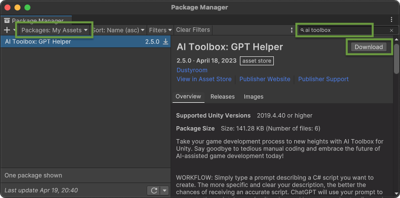
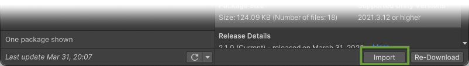
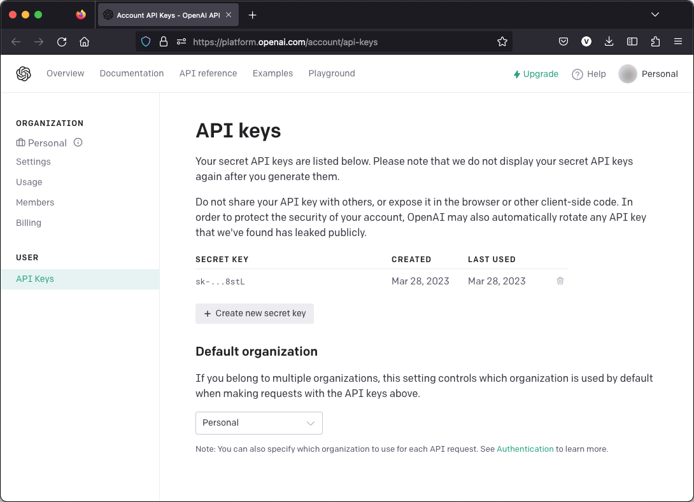
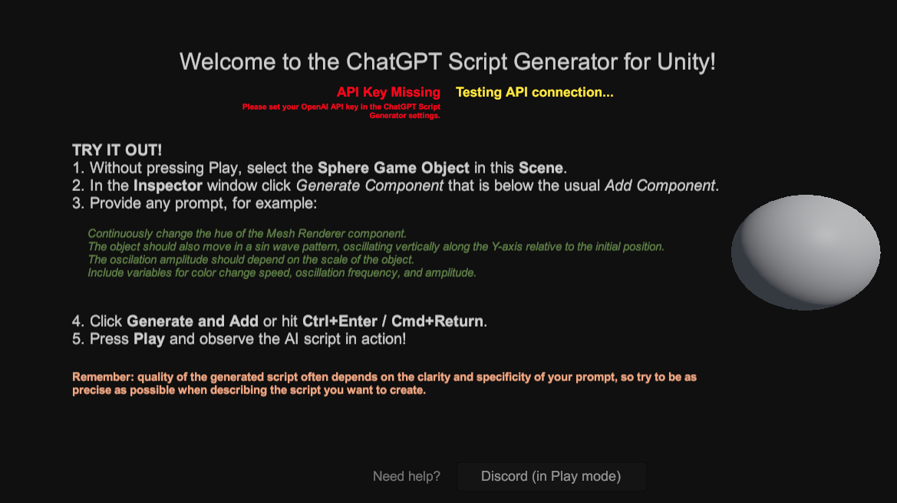
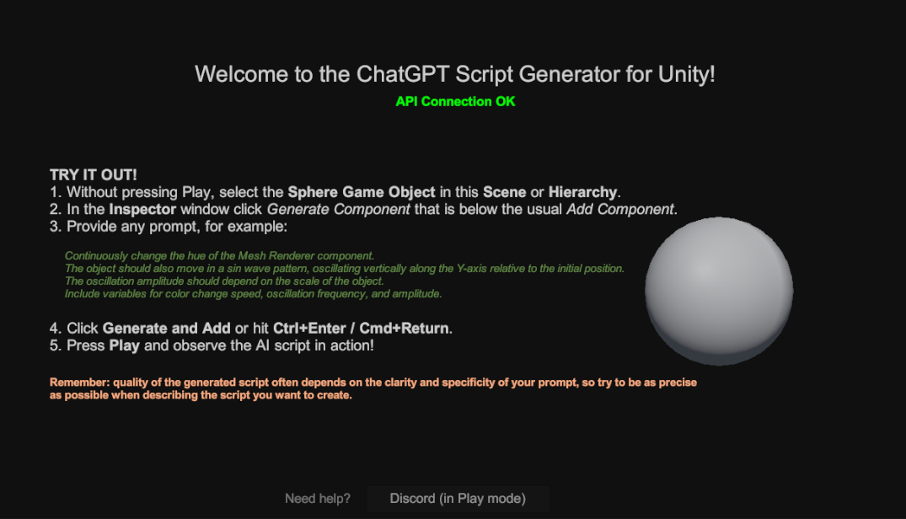

## Quick Setup Guide

<!--
<iframe width="560" height="315" src="https://www.youtube.com/embed/r0uKa10urQE" title="YouTube video player" frameborder="0" allow="accelerometer; autoplay; clipboard-write; encrypted-media; gyroscope; picture-in-picture" allowfullscreen></iframe>
-->

### Downloading and Importing ChatGPT Script Generator
First of all, you need to download and import ChatGPT Script Generator into your project.

  * In Unity, go to **Window** ▶︎ **Package Manager**;
  * On the top left, please locate the **Packages** drop down menu. Select **My Assets** item there. You’ll find **ChatGPT Script Generator** among your assets. Choose the version you’d like to import;
  * Click **Download** (if it is not downloaded yet);
  * Click **Import**.

### API Key Generation
To use the ChatGPT Script Generator, you must first generate an API key for the ChatGPT API:
1. **Sign up or log in** to your OpenAI account: [https://platform.openai.com/](https://platform.openai.com/){:target="_blank"}.
1. Navigate to the **"View API Keys"** section in your account dashboard.
1. Click **"Create new secret key"** and copy the generated key.

{:.image-caption}
Generate an API key for the ChatGPT API on the OpenAI website

### API Key Setup in Unity
Once you have generated the API key, you need to set it up within Unity:
1. Open your Unity project.
1. Click on **"Edit"** in the top menu, then select **"Project Settings**."
1. In the Project Settings window, navigate to the **"ChatGPT Code Generator"** tab.
1. Paste your API key into the **"API Key"** field.

{:.image-caption}
Paste the API key in the **Project Settings**

⚠️ Please be aware that the API key is stored in the following file: `UserSettings/ChatGptScriptGeneratorSettings.asset`. When sharing your project with others, be sure to **exclude the "UserSettings" directory** to prevent unauthorized use of your API key.
{:.notice--danger}

## Welcome Scene

The Welcome scene is a good place to check if your API key is valid, also to see some basic instructions how to start working with ChatGPT Script Generator.

{:.image-caption}
**[Demo] ChatGPT Script Generator** scene shows that the API key is missing

{:.image-caption}
**[Demo] ChatGPT Script Generator** scene shows that after entering the API in the Project Settings, you are ready to go

<!--
The Quick Start scene scene works in all Render Pipelines: Built-in, URP and HDRP.
{:.notice--info}
-->

## If You Have Issues
Please check the [Troubleshooting](/troubleshooting/) page, where the most common issues and their solutions are described. If you still have issues, please [contact us](/contact-details/).

