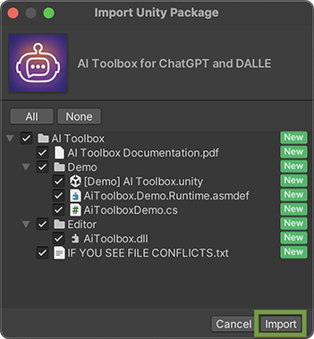

## Quick Setup Guide

<!--
<iframe width="560" height="315" src="https://www.youtube.com/embed/r0uKa10urQE" title="YouTube video player" frameborder="0" allow="accelerometer; autoplay; clipboard-write; encrypted-media; gyroscope; picture-in-picture" allowfullscreen></iframe>
-->

<iframe width="640" height="360" src="https://www.youtube.com/embed/knEAuPbqX-w" title="YouTube video player" frameborder="0" allow="accelerometer; autoplay; clipboard-write; encrypted-media; gyroscope; picture-in-picture" allowfullscreen></iframe>

### Downloading and Importing AI Toolbox
First of all, you need to download and import {{ site.title_short }} into your project.

  * In Unity, go to **Window** ▶︎ **Package Manager**;
  * On the top left, please locate the **Packages** drop down menu. Select **My Assets** item there. You’ll find **{{ site.title }}** among your assets. Choose the version you’d like to import;
  * Click **Download** (if it is not downloaded yet);
  {: .image-simple }
  * Click **Import**.
  {: .image-simple }
  * Click **Import** again.
  {: .image-simple }

### Configuring access to AI services

After the import is complete, you will need to configure the AI backend using one or more of the following methods:
* [OpenAI](/openai-set-up/)
* [Microsoft Azure](/azure-set-up/)
* [Google Gemini](/gemini-set-up/)

## Welcome Scene

The Welcome scene is a good place to check if your configuration is valid, also for some basic instructions how to start working with {{ site.title_short }}.

{:.image-rounded}

{:.image-caption}
**[Demo] {{ site.title_short }}** scene shows that the API key is missing

{:.image-rounded}

{:.image-caption}
**[Demo] {{ site.title_short }}** scene shows that after entering the API in the Project Settings, you are ready to go

After you set it all up, you can start using {{ site.title_short }}. You can [Generate Scripts](/getting-started/#generating-scripts), [Edit generated or already existing scripts](/getting-started/#editing-scripts), [Generate images](/getting-started/#generating-images-with-dalle), generate shaders and UI Documents.

<!--
The Quick Start scene scene works in all Render Pipelines: Built-in, URP and HDRP.
{:.notice--info}
-->

## Troubleshooting
Please check the [FAQs](/faq/) page, where the most common issues and their solutions are described. If you still have issues, please [contact us](/contact-details/).
