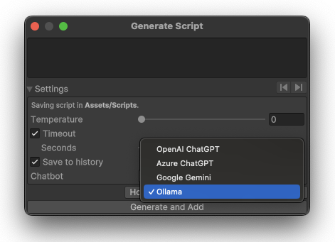
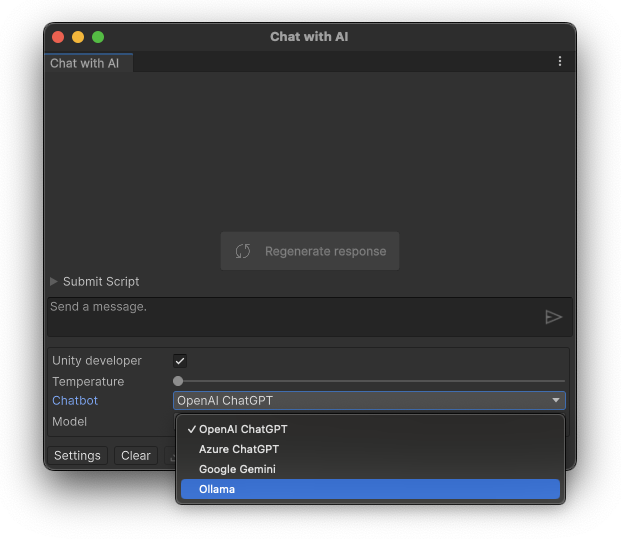

{:.image-simple}

With Ollama you can run popular LLMs like Llama, Gemma, Qwen and dozens of others locally for free!

## Ollama Setup

1. Open AI Toolbox Settings window (Edit ▶︎ Project Settings ▶︎ AI Toolbox ▶︎ 'Ollama' tab).
1. Install the Ollama application locally on your machine: use **Download at ollama.com** button to download the Ollama app. Make sure the app is running after installation.
1. Install at least one Ollama model, either manually from the [Ollama website](https://ollama.com/library), or using the Terminal command `ollama run <model_name>`. For example, to install the _llama 3.2_ model, use the command `ollama run llama3.2`.
1. Test the connection using the **Test Connection** button.

Once you add any additional model, please click the **Refresh installed models** button to update the list of available models in the dropdown.

To remove a model, use the Terminal command `ollama rm <model_name>`.
{:.notice--info}

## Selecting Ollama Chatbot in {{ site.title_short }}

### Selecting Ollama Chatbot in the Code Generation Window

1. Open the **Generate Component** window: _Window_ ▶︎ _{{ site.title_short }}_ ▶︎ _Generate ..._. To open _Generate Script_ window, you can also use the shortcut: `Ctrl+Shift+S` (Windows) or `Cmd+Shift+S` (Mac).
1. Expand **Settings** menu on the bottom of the window.
1. Select **Ollama** in the **Chatbot** dropdown.
1. If you have more than one Ollama model installed, you can select the desired model in the **AI Toolbox Settings** (Edit → Project Settings → AI Toolbox → 'Ollama' tab).

Ollama selected as the backend in the 'Generate Component' window.
{:.image-caption}

### Selecting Ollama Chatbot in the Chat with AI Window

1. Open the **Chat with AI** window: _Window_ ▶︎ _{{ site.title_short }}_ ▶︎ _Chat with AI_, or use the shortcut: `Alt+Shift+C` (Windows) or `Option+Shift+C` (Mac).
1. Click the **Settings** button on the bottom of the window.
1. Select **Ollama** in the **Chatbot** dropdown.
1. If you have more than one Ollama model installed, you can select the desired model in the **Model** dropdown.

Ollama selected as the backend in the 'Chat with AI' window.
{:.image-caption}

## Ollama Models

The wide range of LLMs available in Ollama can be used for code generation, code explanation, and chatting with your AI assistant. Ollama makes it easy to download, manage, and run these models on your own machine.
The list of the available LLMs is available at the [Ollama website](https://ollama.com/library).

Some popular models available in Ollama:
- **DeepSeek-V3**: A powerful Mixture-of-Experts model that is frequently cited for its superior logic and bug-fixing capabilities. It outperforms many proprietary models on the LiveCodeBench benchmark.
- **Llama 3.2**: A powerful open-source model developed by Meta, known for its strong performance in various NLP tasks.
- **Gemma**: A versatile model designed for a wide range of applications, including code generation and natural language understanding.
- **Qwen**: A model optimized for conversational AI, excelling in generating human-like responses.
- **Mistral**: A high-performance model that balances speed and accuracy, suitable for real-time applications.
- **Alpaca**: A fine-tuned version of LLaMA, optimized for instruction-following tasks.
