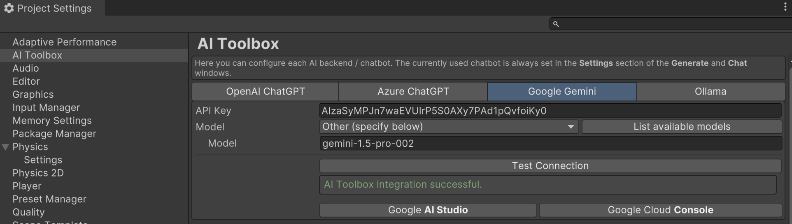

{:.image-simple}

With Ollama you can run popular LLMs like Llama, Gemma, Qwen and dozens of others locally for free!

## Ollama Setup

1. Open AI Toolbox Settings window (Edit → Project Settings → AI Toolbox → 'Ollama' tab).
1. Install the Ollama application locally on your machine: use **Download at ollama.com** button to download the Ollama app. Make sure the app is running after installation.
1. Install at least one Ollama model, either manually from the [Ollama website](https://ollama.com/library), or using the Terminal command `ollama run <model_name>`.
1. Test the connection using the **Test Connection** button.

To remove a model, use the Terminal command `ollama rm <model_name>`.
{:.notice--info}

## Selecting Ollama Models

### Selecting Ollama Models in the Code Generation Window

1. Open the **Generate Component** window (Window → AI Toolbox → Generate ...).
1. Expand **Settings** menu on the bottom of the window.
1. Select **Ollama** in the **Chatbot** dropdown.

Ollama selected as the backend in the 'Generate Component' window.
{:.image-caption}

### Selecting Ollama Models in the Chat with AI Window

1. Open the **Chat with AI** window (Window → AI Toolbox → Chat with AI).
1. Click the **Settings** button on the bottom of the window.
1. Select **Ollama** in the **Chatbot** dropdown.
    1.1 If you have more than one Ollama model installed, you can select the desired model in the **Model** dropdown.

Ollama selected as the backend in the 'Chat with AI' window.
{:.image-caption}

## Ollama Models

The wide range of LLMs available in Ollama can be used for code generation, code explanation, and chatting with your AI assistant.
The list of the available LLMs is available at the [Ollama website](https://ollama.com/library).

<!--
[*Gemini*](https://gemini.google.com/) (aka Bard) is a conversational generative artificial intelligence chatbot developed by Google, based on the state-of-the-art language models. {{ site.title_short }} integrates with *Gemini* to provide a seamless experience for generating code, explaining code, and chatting with your AI assistant.
-->

<!--
As of **{{ site.title_short }} ver 5.1.0** we have greatly simplified the setup process for *Gemini*. Now the setup generally takes just a few minutes and does not require any special knowledge or skills.
{:.notice--info}
-->

---

<!--
Setting up **Gemini** in {{ site.title_short }} consists of the following steps:

1. Set up a *Google Cloud project* using *Google AI Studio*,
1. Configure access to Gemini from Unity.

Let's go through these steps in detail.

## Set up a Google Cloud project

First, you need to create a *Google Cloud project* and get an *API key*.
This is a one-time process that takes a few minutes. After that, you can use Gemini in any {{ site.title_short }} project.

To do this, log into **Google AI Studio** and create and *API key* on the following page: [https://aistudio.google.com/app/apikey](https://aistudio.google.com/app/apikey){:target="_blank"}

{:.image-rounded width="450px"}

Google AI Studio "Get API key" page
{:.image-caption}

If you don't have a Google account, you will need to create one. You can use your existing email address or create a new one.
{:.notice--info}

You can either create a new project or use an existing one. In either case, *Google AI Studio* will automatically configure the project for you.

{:.image-rounded width="450px"}

Google AI Studio "Create API key" menu
{:.image-caption}

Once you have created the *API key*, save it to use in the next step.

## Configure access to Gemini from Unity

Now you need to set up access to the project from your Unity Editor.

1. In Unity, go to **Edit > Project Settings**.
1. Select **{{ site.title_short }}** from the list on the left.
1. Under **Google Gemini** tab, paste the *API key* you obtained in the previous step into the **API Key** field.  
{:.image-rounded}

Gemini settings in {{ site.title_short }}
{:.image-caption}

**Done!** You can now use Gemini in your Unity project to generate scripts, explain code, chat with your AI assistant, etc. To do this, simply select *Google Gemini* in the *Chatbot* dropdown in the code generation window or the chat window.
-->