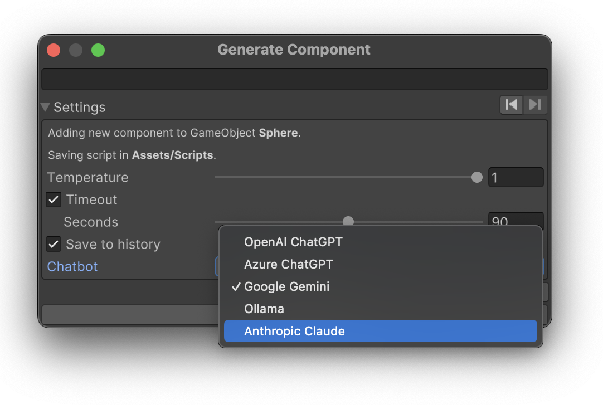
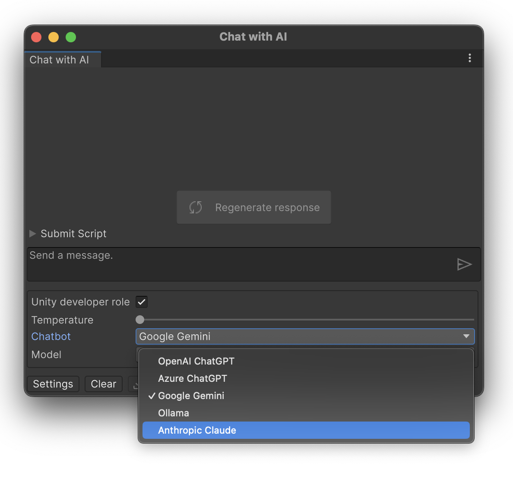

{:.image-simple}

[Claude Sonnet](https://www.anthropic.com/news/claude-sonnet-4-5) is a widely recognized as a premier model for software engineering.
API Pricing details can be found on the [Claude Docs website](https://platform.claude.com/docs/en/about-claude/models/overview)

## Claude Setup

1. Open AI Toolbox Settings window (Edit ▶︎ Project Settings ▶︎ AI Toolbox ▶︎ 'Anthropic Claude' tab).
1. Enter your Claude API key in the **API Key** field.
1. Test the connection using the **Test Connection** button.

Once Anthropic introduces any additional models, {{ site.title_short }} will automatically add it tn its list of available models.

## Selecting Claude Chatbot in {{ site.title_short }}

### Selecting Claude Chatbot in the Code Generation Window

1. Open the **Generate Component** window: _Window_ ▶︎ _{{ site.title_short }}_ ▶︎ _Generate ..._. To open _Generate Script_ window, you can also use the shortcut: `Ctrl+Shift+S` (Windows) or `Cmd+Shift+S` (Mac).
1. Expand **Settings** menu on the bottom of the window.
1. Select **Anthropic Claude** in the **Chatbot** dropdown.

Claude selected as the backend in the 'Generate Component' window.
{:.image-caption}

### Selecting Claude Chatbot in the Chat with AI Window

1. Open the **Chat with AI** window: _Window_ ▶︎ _{{ site.title_short }}_ ▶︎ _Chat with AI_, or use the shortcut: `Alt+Shift+C` (Windows) or `Option+Shift+C` (Mac).
1. Click the **Settings** button on the bottom of the window.
1. Select **Anthropic Claude** in the **Chatbot** dropdown.

Claude selected as the backend in the 'Chat with AI' window.
{:.image-caption}

