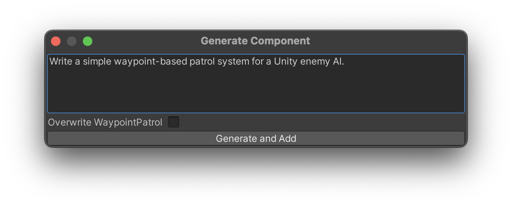
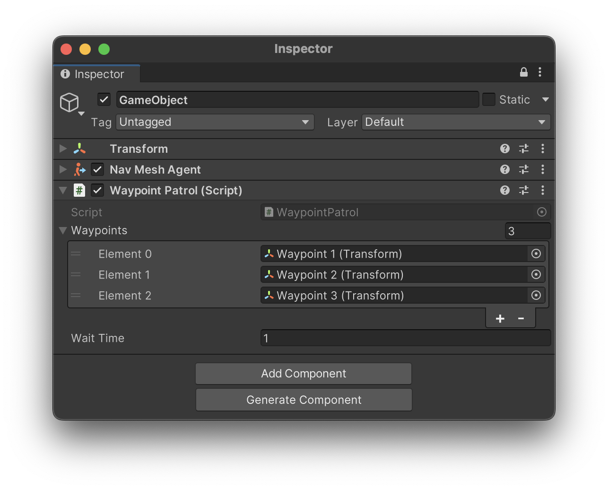
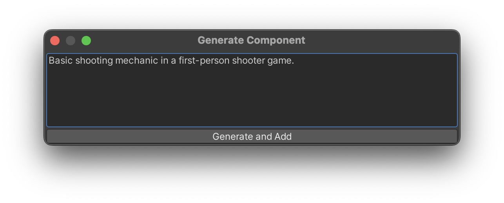
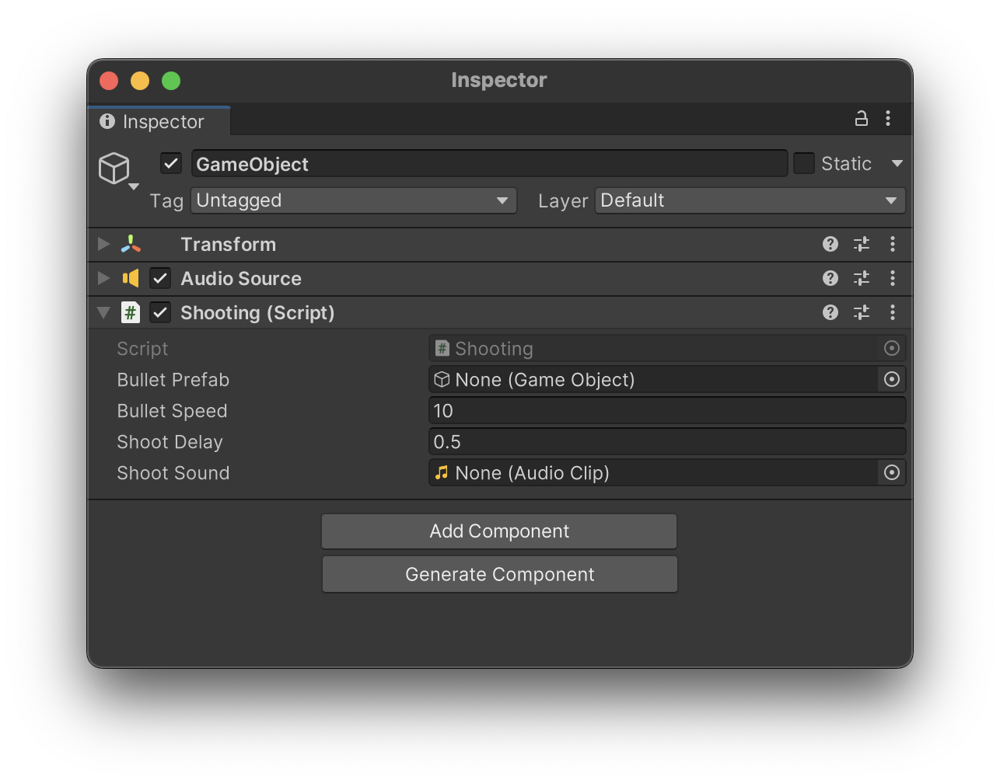
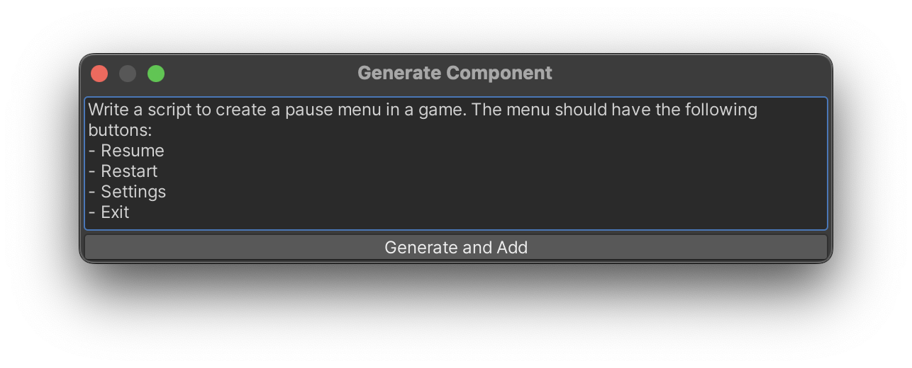
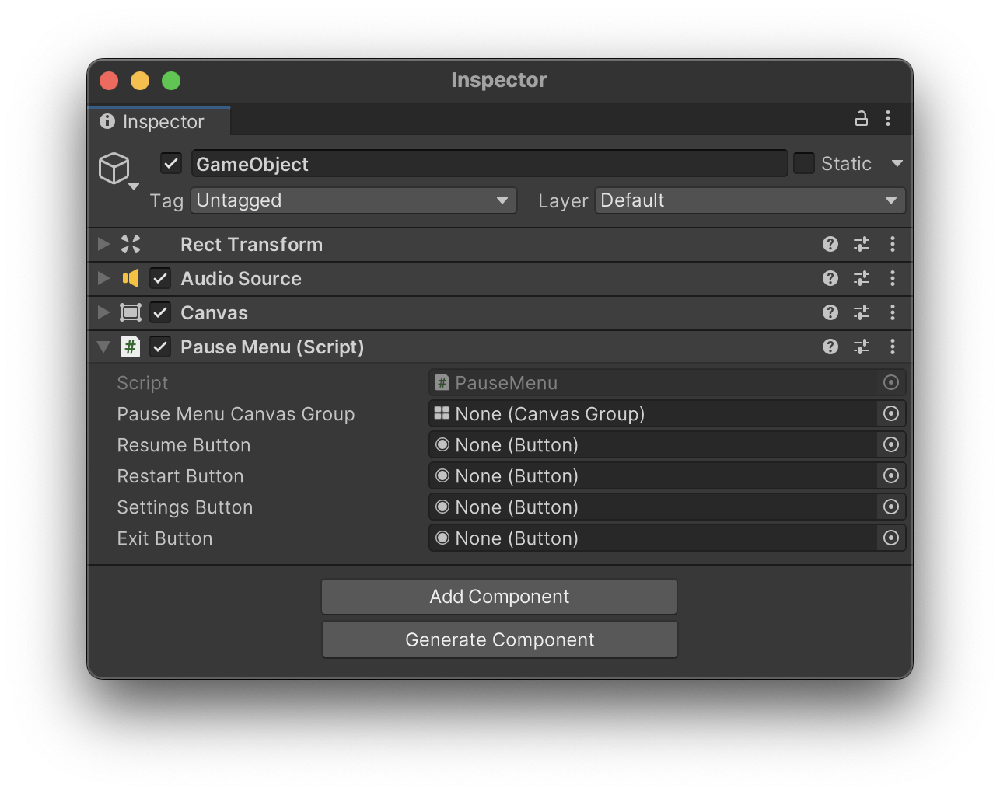

## Overview

This page contains a few examples of the use cases for ChatGPT Script Generator. These are not the only use cases but rather just hints to what you can prompt and how you can phrase your prompts.

## Example C# Scripts


### Example Script 1
This is a basic script, which was generated from a not very descriptive prompt. The script is not very complex, but it is a good starting point for a more complex script. In this case ChatGPT Script Generator also created a Component (_Nav Mesh Agent_) in addition to the _Waypoint Patrol_ script — because the prompt contained the word _system_, which foresees a bit more complex setup of the enemy UI.

#### Prompt



`Write a simple waypoint-based patrol system for a Unity enemy AI.`

#### Generated Script



#### Generated Code

<details><summary>Example 1 — Generated code</summary><div markdown="1">

```hlsl
using UnityEngine;
 
[RequireComponent(typeof(UnityEngine.AI.NavMeshAgent))]
public class WaypointPatrol : MonoBehaviour
{
    [Tooltip("List of waypoints for the enemy to patrol")]
    public Transform[] waypoints;
 
    [Tooltip("Time in seconds to wait at each waypoint")]
    public float waitTime = 1f;
 
    private int currentWaypointIndex;
    private UnityEngine.AI.NavMeshAgent navMeshAgent;
    private float waitTimer;
 
    private void Start()
    {
        navMeshAgent = GetComponent<UnityEngine.AI.NavMeshAgent>();
        currentWaypointIndex = 0;
        waitTimer = 0f;
 
        if (waypoints.Length == 0)
        {
            Debug.LogError("No waypoints assigned to WaypointPatrol script on " + gameObject.name);
        }
        else
        {
            SetDestination();
        }
    }
 
    private void Update()
    {
        if (navMeshAgent.remainingDistance <= navMeshAgent.stoppingDistance)
        {
            waitTimer += Time.deltaTime;
 
            if (waitTimer >= waitTime)
            {
                currentWaypointIndex = (currentWaypointIndex + 1) % waypoints.Length;
                SetDestination();
                waitTimer = 0f;
            }
        }
    }
 
    private void SetDestination()
    {
        navMeshAgent.SetDestination(waypoints[currentWaypointIndex].position);
    }
}
```

</div></details>


### Example Script 2
This is a very brief prompt. As there was nothing specific stated in the request, ChatGPT decided to create a set of the most common controls found in a typical first-person shooter game.

#### Prompt



`Basic shooting mechanic in a first-person shooter game.`

#### Generated Script



#### Generated Code

<details><summary>Example 2 — Generated code</summary><div markdown="1">

```hlsl
using UnityEngine;
 
[RequireComponent(typeof(AudioSource))]
public class Shooting : MonoBehaviour
{
    [Tooltip("The prefab of the bullet to be shot.")]
    public GameObject bulletPrefab;
    [Tooltip("The speed at which the bullet travels.")]
    public float bulletSpeed = 10f;
    [Tooltip("The delay between shots.")]
    public float shootDelay = 0.5f;
    [Tooltip("The sound effect to play when shooting.")]
    public AudioClip shootSound;
 
    private AudioSource audioSource;
    private float lastShotTime;
 
    private void Start()
    {
        audioSource = GetComponent<AudioSource>();
    }
 
    private void Update()
    {
        if (Input.GetMouseButton(0) && Time.time - lastShotTime > shootDelay)
        {
            Shoot();
            lastShotTime = Time.time;
        }
    }
 
    private void Shoot()
    {
        GameObject bullet = Instantiate(bulletPrefab, transform.position, transform.rotation);
        Rigidbody bulletRigidbody = bullet.GetComponent<Rigidbody>();
        bulletRigidbody.velocity = transform.forward * bulletSpeed;
 
        if (shootSound != null)
        {
            audioSource.PlayOneShot(shootSound);
        }
    }
}
```

</div></details>


### Example Script 3
This is quite a nuanced prompt. We requested a set of specific buttons to be included on the menu.

#### Prompt



`Write a script to create a pause menu in a game. The menu should have the following buttons:`
`- Resume`  
`- Restart`  
`- Settings`  
`- Exit`

#### Generated Script



#### Generated Code

<details><summary>Example 3 — Generated code</summary><div markdown="1">

```hlsl
using UnityEngine;
using UnityEngine.SceneManagement;
using UnityEngine.UI;
 
[RequireComponent(typeof(Canvas))]
public class PauseMenu : MonoBehaviour
{
    [Tooltip("The canvas group for the pause menu")]
    [SerializeField] private CanvasGroup pauseMenuCanvasGroup;
 
    [Tooltip("The button to resume the game")]
    [SerializeField] private Button resumeButton;
 
    [Tooltip("The button to restart the game")]
    [SerializeField] private Button restartButton;
 
    [Tooltip("The button to open the settings menu")]
    [SerializeField] private Button settingsButton;
 
    [Tooltip("The button to exit the game")]
    [SerializeField] private Button exitButton;
 
    private void Start()
    {
        // Set up button listeners
        resumeButton.onClick.AddListener(ResumeGame);
        restartButton.onClick.AddListener(RestartGame);
        settingsButton.onClick.AddListener(OpenSettingsMenu);
        exitButton.onClick.AddListener(ExitGame);
    }
 
    private void Update()
    {
        // Toggle pause menu on/off with escape key
        if (Input.GetKeyDown(KeyCode.Escape))
        {
            TogglePauseMenu();
        }
    }
 
    private void TogglePauseMenu()
    {
        // Toggle canvas group alpha and interactivity
        pauseMenuCanvasGroup.alpha = 1 - pauseMenuCanvasGroup.alpha;
        pauseMenuCanvasGroup.interactable = !pauseMenuCanvasGroup.interactable;
        pauseMenuCanvasGroup.blocksRaycasts = !pauseMenuCanvasGroup.blocksRaycasts;
 
        // Pause/unpause game time
        Time.timeScale = 1 - Time.timeScale;
    }
 
    private void ResumeGame()
    {
        TogglePauseMenu();
    }
 
    private void RestartGame()
    {
        SceneManager.LoadScene(SceneManager.GetActiveScene().name);
        Time.timeScale = 1;
    }
 
    private void OpenSettingsMenu()
    {
        // TODO: Implement settings menu
    }
 
    private void ExitGame()
    {
        Application.Quit();
    }
}
```

</div></details>


<!--
{: .image-fancy}
-->
