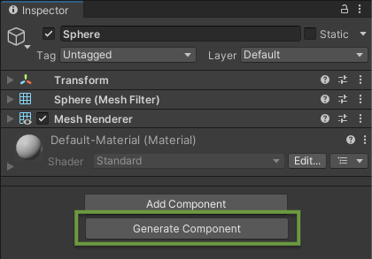
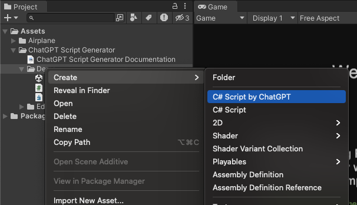

Once you [set up](/installation/) the {{ site.title_short }}, you can start using it to generate C# scripts for your Unity projects.

## Using the {{ site.title_short }}
After setting up the API key, you can now use the {{ site.title_short }} in the Unity Editor:
1. In the Unity Editor, select a GameObject and click the **“Generate Component”** button in
the Inspector.
1. **Type a ChatGPT prompt** describing the C# script you would like to add.
1. Click **"Generate"**, and the script will be automatically created and added to your project.

{: .image-simple }

{:.image-caption}
Press **Generate Component** button to open the prompt box

Alternatively, there is another option to open the prompt box for generating a script. Right-click in the **Project** tab ▶︎ select **Create** ▶︎ click **C# Script by ChatGPT**.

{: .image-simple }

## Important Notices
1. ⚠️ Please be aware that the API key is stored in the following file: `UserSettings/ChatGptScriptGeneratorSettings.asset`. When sharing your project with others, be sure to **exclude the "UserSettings" directory** to prevent unauthorized use of your API key.
1. Please be aware that ChatGPT, being an AI model, **may sometimes generate scripts that cannot be compiled** and will show errors in the Unity Console. While we strive to improve the accuracy and functionality of the generated scripts, we have no direct control over the AI's output.
1. Unfortunatelly, we can't control how the AI will generate the scripts. Sometimes it may generate scripts that are not working or not what you are looking for. To get a better outcome from the AI generated scripts, please have a look at this page for more details: [How To Write Prompts](https://chatgpt.dustyroom.com/how-to-write-prompts/)

## Generating a Script with ChatGPT Prompt Window
Type your request in the prompt window and click **"Generate and Add"** to start the script generation process. You can also use `Ctrl + Ender` (Windows) or `Cmd + Ender` (Mac). The generated script will be added to your project (by default, in `Assets/Scripts`, but you can choose the destination in the _Output Path_ field in the [General Settings](/getting-started/#general-settings)).

{: .image-simple }

{:.image-caption}
The prompt window

- **Advanced Options** — if expanded, reveals the [**Temperature**](/getting-started/#temperature), [**Timeout**](/getting-started/#timeout), [**History**](/getting-started/#prompt-history) parameters, [How To Write Prompts](/how-to-write-prompts/) button , mirrored from the [_Settings panel_](/getting-started/#ai-script-generator-settings) (which can be found in _Edit_ ▶︎ _Project Settings_ ▶︎ _{{ site.title_short }}_).

- **Save to History** — Enable this option to save the generated script to the history. [_History_](/getting-started/#prompt-history) can be accessed with the "_History_" button in this window or in the [_Settings panel_](/getting-started/#ai-script-generator-settings).

{: .image-simple }

{:.image-caption}
The prompt window with advanced options expanded

## Editing the Script with ChatGPT Prompt Window
If you would like to change your generated script, click the "three dots button" on the script on the Inspector panel and select **Edit Script with ChatGPT**. This will open the prompt window.

<a href="/assets/images/manual_images/sg-edit-script-with-chatgpt-2.png">
{: .image-simple }
</a>

{:.image-caption}
Edit the generated script (method 1, from the Inspector panel)

Alternatively, you can select this scipt in the **Project** tab ▶︎ right-click on it ▶︎ select **Edit C# Script with ChatGPT**. This will open the prompt window.

<a href="/assets/images/manual_images/sg-edit-script-with-chatgpt.png">
{: .image-simple }
</a>

{:.image-caption}
Edit the generated script (method 2, from the Project tab)

Once the prompt window is open, you can edit the script and click **Generate** to start the generation process. You can also use `Ctrl + Ender` (Windows) or `Cmd + Ender` (Mac).

- **Left/Right Arrow Buttons** — view the previous and Next prompts from History.

- **Advanced Options** — if expanded, reveals the [**Temperature**](/getting-started/#temperature), [**Timeout**](/getting-started/#timeout), [**History**](/getting-started/#prompt-history) parameters, [How To Write Prompts](/how-to-write-prompts/) button , mirrored from the [_Settings panel_](/getting-started/#ai-script-generator-settings) (which can be found in _Edit_ ▶︎ _Project Settings_ ▶︎ _{{ site.title_short }}_).

- **Save to History** — Enable this option to save the generated script to the history. [_History_](/getting-started/#prompt-history) can be accessed with the "_History_" button in this window or in the [_Settings panel_](/getting-started/#ai-script-generator-settings).

{: .image-simple }

{:.image-caption}
The Edit Script prompt window

### If Editing the Script Results in Errors

{{ site.title_short }} sees if the code that is being generated will have errors and eventually will fail to compile. {{ site.title_short }} will give a few options to address that. If you have any errors when the script is generated, the look of the script generation window will change to the following:

<a href="/assets/images/manual_images/sg-edit-script-with-chatgpt-errors.png">
{: .image-simple }
</a>

{:.image-caption}
Generation window with errors

- **Ask ChatGPT to Fix It** - This will ask the AI to fix the errors.
- **Revert and Edit Prompt** - This will discard the changes made by editing the script.
- **Accept and Edit File** - This will accept the changes and will open the script file to be edited manually.
- **Accept** - This will accept the changes.

## {{ site.title_short }} Settings

The settings can be found in Edit ▶︎ Project Settings ▶︎ {{ site.title_short }}.

### OpenAI API Key

- **API Key** is the field where you will need to paste your API Key, once it is generated [(here is more info on API Key generation)](/installation/#api-key-generation).

⚠️ The API key is stored in the following file: `UserSettings/ChatGPTScriptGeneratorSettings.asset`. When sharing your project with others, be sure to **exclude the "UserSettings" directory** to prevent unauthorized use of your API key.
{:.notice--danger}

{:.image-caption}
OpenAI API Key

### GPT Model

- **Model** is the GPT model that will be used to generate scripts. The default model is _gpt-3.5-turbo_.
- **OpenAI Documentation** opens the [OpenAI documentation](https://platform.openai.com/docs/models){:target="_blank"} in your browser.

{:.image-caption}
GPT Model

### Generation Settings

#### Temperature

- **Temperature** controls randomness: higher _Temperature_ results in more random completions. As the _Temperature_ approaches zero, the model will become deterministic and repetitive. Lower the _Temperature_ to get more or less the same results when you re-iterate the script generations, for example. Raise the _Temperature_ to get more diverse, creative and surprising results upon each completion. Current default _Temperature_ is 0.

{:.image-caption}
Temperature parameter

#### Guiding Prompts

_Guiding Prompts_ are used to help the model generate scripts that are more relevant to your project.

- **+** and **-** buttons add and remove guiding prompts.
- **Reset to default** resets the guiding prompts to the default values.

{:.image-caption}
Guiding Prompts settings

#### Timeout

The maximum time in seconds to wait for a response from ChatGPT. If ChatGPT doesn't respond within the _Timeout_, the script generation fails. Current default _Timeout_ is 60 seconds.

{:.image-caption}
Timeout settings

### General Settings

- **Output Path** is the path where the generated scripts will be saved. By default, it is set to `Assets/Scripts`.
- **Inspector button** if enabled, the _"Generate Component"_ button appears on every Game Object's Inspector panel.

{:.image-caption}
General settings

### Prompt History

- **View History** shows the history of the prompts you have used to generate scripts as well as some other useful bits of information.

{:.image-caption}
History settings

<a href="/assets/images/manual_images/sg-project-settings-history-window.png">
{: .image-simple }
</a>

{:.image-caption}
History settings window

### Useful Links

- **OpenAI Status Page** opens the [OpenAI Status Page](https://status.openai.com/){:target="_blank"} in your browser.
- **ChatGPT Playground** opens the [ChatGPT Playground](https://playground.openai.com/){:target="_blank"} in your browser.
- **How to write prompts** opens the [How to write prompts](/how-to-write-prompts/){:target="_blank"} page of this documentation in your browser.
- **Discord** opens {{ site.title_short }} support [Discord](https://discord.gg/xqfh46kKfw){:target="_blank"} channel in your browser.
- **Asset Store Page** opens the [{{ site.title_short }}](https://u3d.as/334o?aid=1101lHzQ){:target="_blank"} Asset Store page in your browser.

{:.image-caption}
Useful Links

## If You Have Issues
Please check the [Troubleshooting](/troubleshooting/) page, where the most common issues and their solutions are described. If you still have issues, please [contact us](/contact-details/).

