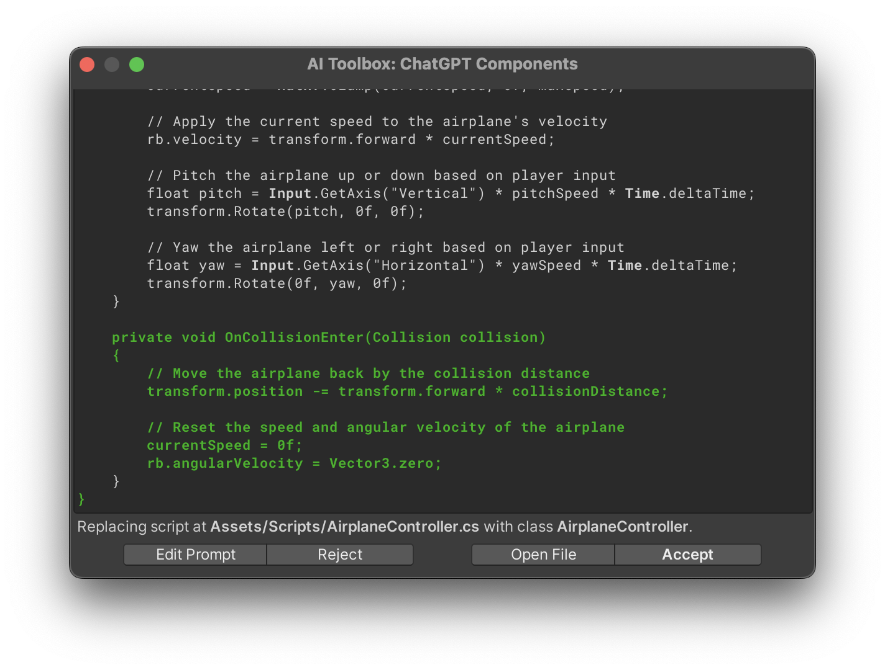

Once you [set up](/installation/) the {{ site.title_short }}, you can start using it to [generate](/getting-started/#generating-a-script-with-chatgpt-prompt-window) and [edit C# scripts](/getting-started/#editing-the-script-with-chatgpt-prompt-window), [generate images](/getting-started/#generating-images-with-dalle), shaders and UI documents for your Unity projects.

## Generating a Script with ChatGPT Prompt Window

<iframe width="640" height="360" src="https://www.youtube.com/embed/cNq-uCBq5yU" title="YouTube video player" frameborder="0" allow="accelerometer; autoplay; clipboard-write; encrypted-media; gyroscope; picture-in-picture" allowfullscreen></iframe>

To generate a script with ChatGPT, you'll need to open the prompt window. There are two ways to do this:

1. In the Unity Editor, select a GameObject and click the **“Generate Component”** button in
the Inspector.
1. **Type a ChatGPT prompt** describing the C# script you would like to add.
1. Click **"Generate"**, and the script will be automatically created and added to your project.

{: .image-rounded }

{:.image-caption}
Press **Generate Component** button to open the prompt box

Alternatively, there is another option to open the prompt box for generating a script. Right-click in the **Project** tab ▶︎ select **Create** ▶︎ click **C# Script by ChatGPT**.

{: .image-rounded }

Type your request in the prompt window and click **"Generate and Add"** to start the script generation process. You can also use `Ctrl + Enter` (Windows) or `Cmd + Return` (Mac). The generated script will be added to your project (by default, in `Assets/Scripts`, but you can choose the destination in the _Output Path_ field in the [General Settings](/getting-started/#general-settings)).

<a href="/assets/images/manual_images/sg-prompt-window-1_1.png">
{: .image-rounded }
</a>

{:.image-caption}
The prompt window

- **Advanced Options** — if expanded, reveals the [**Temperature**](/getting-started/#temperature), [**Timeout**](/getting-started/#timeout), [**History**](/getting-started/#prompt-history) parameters, [How To Write Prompts](/how-to-write-prompts/) button , mirrored from the [_Settings panel_](/getting-started/#ai-script-generator-settings) (which can be found in _Edit_ ▶︎ _Project Settings_ ▶︎ _{{ site.title_short }}_).

- **Save to History** — Enable this option to save the generated script to the history. [_History_](/getting-started/#prompt-history) can be accessed with the "_History_" button in this window or in the [_Settings panel_](/getting-started/#ai-script-generator-settings).

<a href="/assets/images/manual_images/sg-prompt-window-1_2.png">
{: .image-rounded }
</a>

{:.image-caption}
The prompt window with advanced options expanded

## Editing the Script with ChatGPT Prompt Window

<iframe width="640" height="360" src="https://www.youtube.com/embed/fedn7A9JTXA" title="YouTube video player" frameborder="0" allow="accelerometer; autoplay; clipboard-write; encrypted-media; gyroscope; picture-in-picture" allowfullscreen></iframe>

If you would like to change your generated script, click the "three dots button" on the script on the Inspector panel and select **Edit Script with ChatGPT**. This will open the prompt window. To enable or disable auto-accepting of the edits, please go to the [General Settings](/getting-started/#general-settings) and check the _Auto-accept edits_ checkbox.

<a href="/assets/images/manual_images/sg-edit-script-with-chatgpt-2.png">
{: .image-rounded }
</a>

{:.image-caption}
Edit the generated script (method 1, from the Inspector panel)

Alternatively, you can select this scipt in the **Project** tab ▶︎ right-click on it ▶︎ select **Edit C# Script with ChatGPT**. This will open the prompt window.

<a href="/assets/images/manual_images/sg-edit-script-with-chatgpt.png">
{: .image-rounded }
</a>

{:.image-caption}
Edit the generated script (method 2, from the Project tab)

Once the prompt window is open, you can edit the script and click **Generate** to start the generation process. You can also use `Ctrl + Enter` (Windows) or `Cmd + Return` (Mac).

- **Left/Right Arrow Buttons** — view the previous and next prompts from History.

- **Advanced Options** — if expanded, reveals the [**Temperature**](/getting-started/#temperature), [**Timeout**](/getting-started/#general-settings), [**History**](/getting-started/#prompt-history) parameters, [How To Write Prompts](/how-to-write-prompts/) button , mirrored from the [_Settings panel_](/getting-started/#ai-toolbox-settings) (which can be found in _Edit_ ▶︎ _Project Settings_ ▶︎ _{{ site.title_short }}_).

- **Save to History** — Enable this option to save the generated script to the history. [_History_](/getting-started/#prompt-history) can be accessed with the "_History_" button in this window or in the [_Settings panel_](/getting-started/#ai-toolbox-settings).

<a href="/assets/images/manual_images/sg-prompt-window-editing.png">
{: .image-rounded }
</a>

{:.image-caption}
The Edit Script prompt window

_AI Toolbox_ looks whether the generation is going successfully or it is going to have potential errors. If the script generation went without errors, by default you will have a new script in your project (by default, in `Assets/Scripts`, but you can choose the destination in the _Output Path_ field in the [General Settings](/getting-started/#general-settings)).
If you have the _Auto-accept_ option turned off, you'll be presented with an according window in the end each generation process. To change this option, go to the [General Settings](/getting-started/#general-settings) and check the _Auto-accept new files_ checkbox.

<a href="/assets/images/manual_images/sg-prompt-window-editing-success.png">
{: .image-rounded }
</a>

{:.image-caption}
The window showing the successfully completed script generation (Auto-accept option is 'off')

- **Edit Prompt** - This will open the prompt window containing the prompt text that was used to generate the script.
- **Reject** - This will discard the changes made by editing the script.
- **Open File** - This will open the script file in the default text editor.
- **Accept** - This will accept the changes to the script.

### If Editing the Script Results in Errors

{{ site.title_short }} sees if the code that is being generated will have errors and eventually will fail to compile. {{ site.title_short }} will give a few options to address that. If you have any errors when the script is generated, the look of the script generation window will change to the following:

<a href="/assets/images/manual_images/sg-prompt-window-editing-errors.png">
{: .image-rounded }
</a>

{:.image-caption}
Generation window with errors

- **Ask ChatGPT to Fix It** - This will ask the AI to fix the errors.
- **Revert and Edit Prompt** - This will discard the changes made by editing the script.
- **Accept and Edit File** - This will accept the changes and will open the script file to be edited manually.
- **Accept** - This will accept the changes.

## Generating Images with DALL•E

<iframe width="640" height="360" src="https://www.youtube.com/embed/6HlO9LsTLW0" title="YouTube video player" frameborder="0" allow="accelerometer; autoplay; clipboard-write; encrypted-media; gyroscope; picture-in-picture" allowfullscreen></iframe>

{{ site.title_short }} can generate images using the [DALL•E](https://openai.com/blog/dall-e/) model. To generate an image, you need to have a prompt that contains the text description of the image you want to generate. The prompt can be as simple as "A brick wall texture" or as complex as "A futuristic retro space ship landing on a snow-covered planet". The more complex the prompt, the more detailed the image will be.

To open the DALL•E generation propmt window, right-click anywhere in the Project tab and select **Create** ▶︎ **Texture by DALL•E**.

<a href="/assets/images/manual_images/dall-e-texture-by-dall-e.png">
{: .image-rounded }
</a>

{:.image-caption}
'Generate texture by DALL•E' menu item

You'll need to type your prompt in the prompt field and click **Generate** to start the generation process. You can also use `Ctrl + Enter` (Windows) or `Cmd + Return` (Mac).

- **Resolution** - Opens a drop down menu where you can select the resolution of the image to be generated. The options are: _256x256 px_ (default), _512x512 px_, _1024x1024 px_.
- **Tileable** - Generates a texture that can be seamlessly tiled.
    - **Seam Size** - The size of the seam if _Tileable_ generating is enabled. The default value is 0.05.
- **Left/Right Arrow Buttons** — view the previous and next prompts from History.
- **Advanced Options** — if expanded, reveals the [**Timeout**](/getting-started/#general-settings), **Save to History** parameters, [Settings](/getting-started/#ai-toolbox-settings) button and [How To Write Prompts](/how-to-write-prompts/), and [**History**](/getting-started/#prompt-history) buttons, mirrored from the [_Settings panel_](/getting-started/#ai-toolbox-settings) (which can be found in _Edit_ ▶︎ _Project Settings_ ▶︎ _{{ site.title_short }}_).

<a href="/assets/images/manual_images/dall-e-prompt-window-seamless.png">
{: .image-rounded }
</a>

{:.image-caption}
DALL•E prompt window

When the generation is completed. you will see the following options:
- **Prompt field** - This is the field where you can edit the prompt.
- **Save and Generate Again** - This will save the generated image to the folder set in [Output Path](/getting-started/#general-settings) (by default, it is `Assets/Generated`) and will generate another image without closing this window.
- **Discard and Generate Again** - This will discard the generated image and will generate another image without closing this window.
- **Done** - This will close the window and will save the generated image to the folder set in [Output Path](/getting-started/#general-settings) (by default, it is `Assets/Generated`).

<a href="/assets/images/manual_images/dall-e-generated-texture-window-seamless.png">
{: .image-rounded }
</a>

{:.image-caption}
Generated texture window

## Generating Shaders with ChatGPT

You can generate shaders with {{ site.title_short }}. To do that, you need to have a prompt that contains the text description of the shader you want to generate.

From experience, we've found that the best way to have successful results is to start with generating a very simple shader and then gradually add more complexity to it using the **Follow-up** button, which appears upon every generation process completion (described below in this paragraph), or you can use the [Edit Shader with ChatGPT](#editing-shaders-with-chatgpt) feature.

Please note that the outcome of the generation process completely depends on the GPT shader generation abilities.
{:.notice--warning}

To open the shader generation propmt window, right-click anywhere in the Project tab (or click **+** there) and select **Create** ▶︎ **Shader** ▶︎ **ChatGPT**. Alternatively, you can go to _Window_ ▶︎ _{{ site.title_short }}_ ▶︎ _Generate Shader_.

<a href="/assets/images/manual_images/gpt-shader-generate-menu-item-method-1.png">
{: .image-rounded }
</a>

{:.image-caption}
Shader generate menu item, method 1

<a href="/assets/images/manual_images/gpt-shader-generate-menu-item-method-2.png">
{: .image-rounded }
</a>

{:.image-caption}
Shader generate menu item, method 2

Once you have your prompt, click **Generate** to start the generation process. You can also use `Ctrl + Enter` (Windows) or `Cmd + Return` (Mac).

{:.image-caption}
Shader generation prompt window

When the generation process is completed, you will see the popped up post-generation menu.
- **Edit Prompt** - This won't save the shader and will open the prompt window where you can edit the prompt to make another generation attempt. Shortcut: `Backspace`.
- **Reject** - This will reject the generated shader and will close the window. Shortcut: `Esc`.
- **Follow-up** - Iterate with ChatGPT on the generated code.
- **Open File** - This will open the generated shader file in the default application for the file type. Shortcut: shortcut: `Ctrl+Enter` / `Cmd+Return`.
- **Accept** - This will save the generated shader and will close the window. Shortcut: `Enter`.

{:.image-caption}
The menu after the shader generation

## Editing Shaders with ChatGPT

With {{ site.title_short }}, you can edit shaders with ChatGPT. To do that, you need to select a shader file, on the Inspector panel you should see the **Edit Shader with ChatGPT** button.

<a href="/assets/images/manual_images/gpt-shader-edit-button.png">
{: .image-simple }
</a>

{:.image-caption}
Edit Shader with ChatGPT button

ChatGPT will edit both human-written and generated shaders.
{:.notice--info} 

## Chat with AI

With {{ site.title_short }}, you can chat with **ChatGPT** and **Google Bard** within Unity. You can ask AI to explain the code, ask it how to do operations in Unity, or ask any questions in this freeform chat.

If ChatGPT outputs any piece of code, you have an option to save it as a file in the project.

To open the **Chat with AI** window, go to _Window_ ▶︎ _{{ site.title_short }}_ ▶︎ _Chat with AI_.

<a href="/assets/images/manual_images/gpt-chat-menu-item-1.png">
{: .image-rounded }
</a>

{:.image-caption}
Chat with AI menu item

Once you open the chat window, you are good to ask away. You'll see the _Send a message_ field where you can type your message in the bottom of the window. Type your prompt and press the send button, shortcut: `Ctrl + Enter` (Windows) or `Cmd + Return` (Mac).

- **'Pencil' button** - This will open the prompt window where you can edit the prompt to make another generation attempt.
- **Copy button** - Copy the AI response to clipboard.
- **Save button** - Saves the code within the AI response as a file in the project.
- **Regenerate response** - Tries generating another variation of the reply from AI to your latest prompt. If the Temperature is set to 0 in the _Settings_ foldout menu (described below), this will generate the same response.
- **Clear** - Clear the chat history.
- **Settings** - Expands and collapses the foldout menu revealing the settings applicable to the chat.
  - **Unity developer** - AI assumes a role of a Unity developer. If disabled, AI has no specific role.
  - **Temperature** - Controls randomness. Lower values result in less random completions. As the temperature approaches zero, the model will become deterministic and repetitive. Higher values result in more random completions.
- **'Paper airplane' button** - Send the message. Shortcut: `Ctrl + Enter` (Windows) or `Cmd + Return` (Mac).
- **GPT model** (on the window footer) - This is the button that upon click switches between installed [GPT models](/getting-started/#gpt-model) for responses just for the chat. Currently, these models are available: **GPT3.5**, **GPT4**, **Google Bard**. The model used for other generation purposes (scripts, images etc) can be changed in the [AI Toolbox Settings](/getting-started/#ai-toolbox-settings).

An obvious thing, but just to remind, the results of the chatting with AI including the code explanations, how-to's etc largely depend on the [GPT model](/getting-started/#gpt-model) set in the AI Toolbox settings.
{:.notice--warning} 

{:.image-caption}
An example of coversation with ChatGPT (GPT4 model used)

The _Chat with ChatGPT_ window is dockable and can be placed anywhere in the Unity Editor so that you always have an access to this window.
{:.notice--info}

- **Submit Script** foldable menu is used to submit the script to the AI Toolbox for further processing. Just select the script file in the **File** field (or drag and drop the script onto it) and select the desired operation using the buttons below it.

{:.image-caption}
Options to operate on files

## {{ site.title_short }} Settings

The settings can be found in Edit ▶︎ Project Settings ▶︎ {{ site.title_short }}.

### OpenAI API Key

- **API Key** is the field where you will need to paste your API Key, once it is generated [(here is more info on API Key generation)](/installation/#api-key-generation).
- **Use Proxy Server** - Use the proxy URL for the OpenAI API. Once you click the _Use Proxy Server_ button, the short guide on how to obtain a free API key will appear.

{:.image-caption}
Proxy Server settings and guide

⚠️ The API key is stored in the following file: `UserSettings/ChatGPTScriptGeneratorSettings.asset`. When sharing your project with others, be sure to **exclude the "UserSettings" directory** to prevent unauthorized use of your API key.
{:.notice--danger}

{:.image-caption}
OpenAI API Key

- **Model** is the GPT model that will be used to generate scripts. Currently, there are two options: _gpt-3.5-turbo_ and _GPT-4_. The default model is _gpt-3.5-turbo_.
- **Model version** — the version of the model to use. This list is constantly updated with the new versions as they are released.
- **OpenAI Documentation** opens the [OpenAI documentation](https://platform.openai.com/docs/models){:target="_blank"} in your browser.

{:.image-caption}
GPT Model

### Google Bard

You can use Google Bard AI model to generate scripts and chat with AI usin this GPT. The detailed step-by-step guide on the Google Bard setup is [here](/bard-set-up/).

{:.image-caption}
Google Bard settings and guide

### Generation Settings

- **Default temperature** controls randomness: higher _Temperature_ results in more random completions. As the _Temperature_ approaches zero, the model will become deterministic and repetitive. Lower the _Temperature_ to get more or less the same results when you re-iterate the script generations, for example. Raise the _Temperature_ to get more diverse, creative and surprising results upon each completion. Current default _Temperature_ is 0.

{:.image-caption}
Temperature parameter

### Guiding Prompts

_Guiding Prompts_ are used to help the model generate scripts that are more relevant to your project.

- **Result Type** - this is the drop down menu where you can recall the predefined guiding prompts for different AI types.
- **+** and **Trash Bin** buttons add and remove guiding prompts.
- **Checkboxes** enable or disable guiding prompts without deleting them.
- **Reset to default** resets the guiding prompts to the default values.

{:.image-caption}
Guiding Prompts settings

The _Result type_ drop down menu contains the pre-saved guiding prompts for generating the components (scripts), shaders, UI Documents and Textures.

{:.image-caption}
Guiding Prompts _Result types_ drop down menu

### General Settings

- **Timeout** - if enabled, the _Duration_ field appears. If ChatGPT doesn't respond within the _Duration_ parameter of the _Timeout_, the script generation fails. Try increasing this value if ChatGPT constantly outputs the 'timeout' error. (If you have this error, please also look at [this paragraph](/troubleshooting/#i-am-getting-a-timeout-issue)) Current default _Duration_ is 60 seconds.
- **Duration** - is the time in seconds that the script generation process will wait for a response from ChatGPT.
- **Output Path** - is the path where the generated scripts will be saved. By default, it is set to `Assets/Scripts`.
- **Inspector button** - if enabled, the _"Generate Component"_ button appears on every Game Object's Inspector panel.
- **Auto-accept new files** - if enabled, the script generation window will be automatically closed after the new script is generated and saved. If disabled, the script generation window will stay open and you will be able to choose a further action with the script.
- **Auto-accept edits** - if enabled, the script generation window will be automatically closed after the edited script is saved. If disabled, the script generation window will stay open and you will be able to choose a further action with the script. More info about these actions can be found [here](/getting-started/#editing-the-script-with-chatgpt-prompt-window).

{:.image-caption}
General settings

### Prompt History

- **View History** shows the history of the prompts you have used to generate scripts as well as some other useful bits of information.
    - **Guiding Prompts** foldout - expands/collapses the set of guiding prompts used in the generation from that particular prompt.
    - **Delete** - deletes the prompt from the history.
    - **Copy** - copies the prompt to the clipboard.
    - **Clear History** - clears the history.

{:.image-caption}
History settings

<a href="/assets/images/manual_images/sg-project-settings-history-window.png">
{: .image-rounded }
</a>

{:.image-caption}
Prompt History window

### Useful Links

- **OpenAI Status Page** opens the [OpenAI Status Page](https://status.openai.com/){:target="_blank"} in your browser.
- **ChatGPT Playground** opens the [ChatGPT Playground](https://playground.openai.com/){:target="_blank"} in your browser.
- **How to write prompts** opens the [How to write prompts](/how-to-write-prompts/){:target="_blank"} page of this documentation in your browser.
- **Discord** opens {{ site.title_short }} support [Discord](https://discord.gg/xqfh46kKfw){:target="_blank"} channel in your browser.
- **Asset Store Page** opens the [{{ site.title_short }}](https://u3d.as/334o?aid=1101lHzQ){:target="_blank"} Asset Store page in your browser.

{:.image-caption}
Useful Links

## Troubleshooting
Please check the [FAQs](/faq/) page, where the most common issues and their solutions are described. If you still have issues, please [contact us](/contact-details/).
