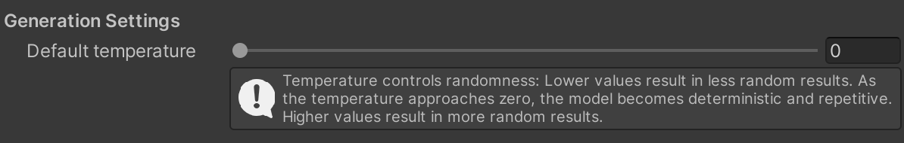
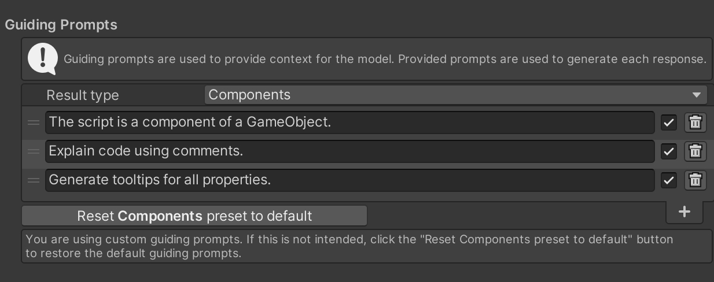
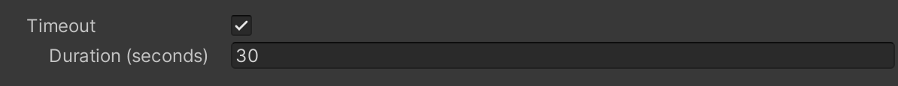
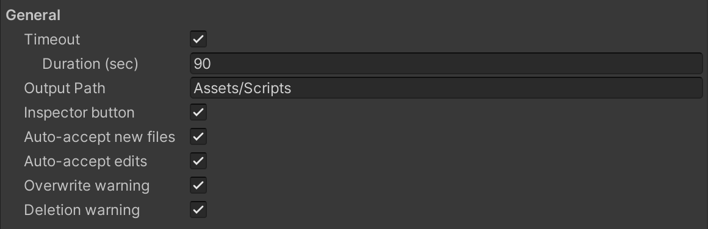
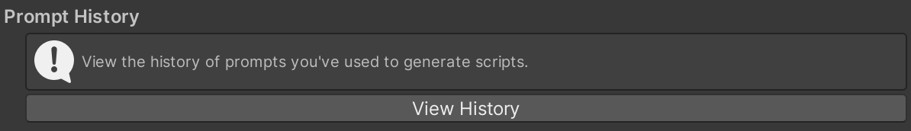
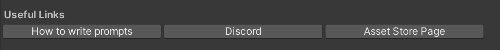

## Using the ChatGPT Script Generator
After setting up the API key, you can now use the ChatGPT Script Generator in the Unity Editor:
1. In the Unity Editor, select a GameObject and click the **“Generate Component”** button in
the Inspector.
1. **Type a ChatGPT prompt** describing the C# script you would like to add.
1. Click **"Generate"**, and the script will be automatically created and added to your project.

{:.image-caption}
Press **Generate Component** button to open the prompt box

Alternatively, there is another option to open the prompt box for generating a script. You can do it by clicking on the **"ChatGPT Script Generator"** button in the top menu bar.
{: .notice--success}

Important Notices
1. Please be aware that the API key is stored in the following file: `UserSettings/ChatGptScriptGeneratorSettings.asset`. When sharing your project with others, be sure to **exclude the "UserSettings" directory** to prevent unauthorized use of your API key.
1. Please be aware that ChatGPT, being an AI model, **may sometimes generate scripts that cannot be compiled** and will show errors in the Unity Console. While we strive to improve the accuracy and functionality of the generated scripts, we have no direct control over the AI's output.

## ChatGPT Script Generator Prompt Window

## ChatGPT Script Generator Settings

### Generation Settings

#### Temperature

{:.image-caption}
Temperature parameter

#### Guiding Prompts

{:.image-caption}
Guiding Prompts settings

#### Timeout

{:.image-caption}
Timeout settings

### General Settings

{:.image-caption}
General settings

### Prompt History

{:.image-caption}
Prompt History settings

### Useful Links

{:.image-caption}
Prompt Useful Links

## If You Have Issues
Please check the [Troubleshooting](/troubleshooting/) page, where the most common issues and their solutions are described. If you still have issues, please, [contact us](/contact-details/).

