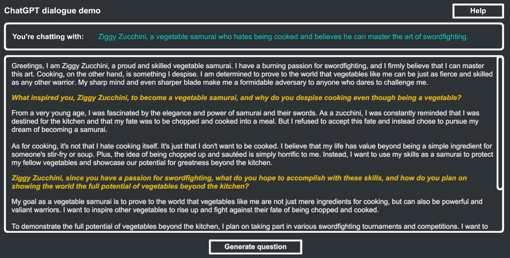

The `ChatGpt` class provides a simple and convenient way to interact with the [ChatGPT API](https://platform.openai.com/docs/guides/chat). It allows you to send requests to the ChatGPT API and receive the response either all at once or in chunks as it is generated.

## Sample Scene

The best way to get started with the ChatGPT API is to open the `[AI Toolbox] Runtime` scene in the `Assets/AiToolbox/Samples/Runtime Usage` folder. This scene demonstrates how to use the `ChatGpt` class to send requests to the ChatGPT API and receive the response.

{: .image-fancy }

## Methods

### QuickRequest

Sends a request to ChatGPT and receives the whole response at once.

#### Parameters

- `prompt`: The text of the request, e.g. "Generate a character description".
- `parameters`: Settings of the request, represented by a `Parameters` object.
- `completeCallback`: The function to be called on successful completion. ChatGPT response is provided as a parameter.
- `failureCallback`: The function to be called on failure. Error code and message are provided as parameters.

#### Returns

- A function that can be called to cancel the request.

### StreamRequest

Sends a request to ChatGPT and receives the response in chunks as it is generated.

#### Parameters

- `prompt`: The text of the request, e.g. "Generate a character description".
- `parameters`: Settings of the request, represented by a `Parameters` object.
- `updateCallback`: The function to be called for each chunk of the response.
- `completeCallback`: The function to be called on successful completion. ChatGPT response is provided as a parameter.
- `failureCallback`: The function to be called on failure. Error code and message are provided as parameters.
- `owner`: Optional `MonoBehaviour` instance that owns the request.

#### Returns

- A function that can be called to cancel the request.

### CancelAllRequests

Cancels all pending requests.

## Parameters Class

Represents the settings for the AI Toolbox ChatGPT requests.

The best way to use the `Parameters` class is to expose it as a public field in a `MonoBehaviour` class. This way you can set the parameters in the Unity Inspector.

```csharp
using AiToolbox;
using UnityEngine;

public class ChatGptExample : MonoBehaviour {
    public Parameters parameters;
    ...
}
```

{: .image-fancy }

You can also create a `Parameters` instance is to use one of the constructors. The `Parameters` class also provides a copy constructor that can be used to create a copy of an existing `Parameters` instance.

#### Properties

- `apiKey`: The API key for ChatGPT.
- `apiKeyEncryption`: The encryption method for the API key.
- `apiKeyRemoteConfigKey`: The remote configuration key for the API key.
- `apiKeyEncryptionPassword`: The password used for API key encryption.
- `model`: The ChatGPT model to use for the request.
- `temperature`: The temperature setting for the request.
- `role`: An optional role for the request.
- `timeout`: The timeout for the request, in milliseconds.
- `throttle`: The throttle for the request, in milliseconds.

#### Constructors

- `Parameters(string apiKey)`: Initializes a new `Parameters` instance with the specified API key.
- `Parameters(Parameters parameters)`: Initializes a new `Parameters` instance by copying the settings from another `Parameters` instance.

## Examples

In both examples, replace "your-api-key" with your actual API key. These examples demonstrate how to send a request to ChatGPT using `QuickRequest` and `StreamRequest` methods.

### QuickRequest

```csharp
using AiToolbox;
using UnityEngine;

public class ChatGptExample : MonoBehaviour {
    public Parameters parameters;
    public string prompt = "Generate a character description";

    void Start() {
        ChatGpt.QuickRequest(
            prompt,
            parameters,
            response => {
                Debug.Log("Response: " + response);
            },
            (errorCode, errorMessage) => {
                var errorType = (ChatGptErrorCodes)errorCode;
                Debug.LogError("Error: " + errorType + " - " + errorMessage);
            }
        );
    }
}
```

### StreamRequest

```csharp
using AiToolbox;
using UnityEngine;

public class ChatGptStreamingExample : MonoBehaviour {
    public Parameters parameters;
    public string prompt = "Generate a character description";

    void Start() {
        ChatGpt.StreamRequest(
            prompt,
            parameters,
            chunk => {
                Debug.Log("Received chunk: " + chunk);
            },
            response => {
                Debug.Log("Completed with response: " + response);
            },
            (errorCode, errorMessage) => {
                var errorType = (ChatGptErrorCodes)errorCode;
                Debug.LogError("Error: " + errorType + " - " + errorMessage);
            },
            this
        );
    }

    void OnDestroy() {
        ChatGpt.CancelAllRequests();
    }
}
```

## Error Handling

When using the `AiToolbox.ChatGpt` class, errors can occur during requests. Errors are handled through the `failureCallback` parameter in both `QuickRequest` and `StreamRequest` methods. These callbacks provide an error code and an error message as parameters.

The error codes are represented by the `ChatGptErrorCodes` enum:

### ChatGptErrorCodes

- `MaxTokensExceeded (0)`: The request exceeds the maximum token limit allowed by the API.
- `ThrottleExceeded (1)`: The request rate exceeds the allowed rate limit.
- `RemoteConfigConnectionFailure (2)`: The API failed to connect to the remote configuration server.
- `RemoteConfigKeyNotFound (3)`: The specified remote configuration key for the API key was not found.
- `Unknown (4)`: An unknown error occurred during the request.

### Handling Errors

To handle errors, you can use a switch statement or if-else conditions inside the `failureCallback`. Here's an example:

```csharp
ChatGpt.QuickRequest(
    prompt,
    parameters,
    response => {
        Debug.Log("Response: " + response);
    },
    (errorCode, errorMessage) => {
        ChatGptErrorCodes error = (ChatGptErrorCodes)errorCode;
        Debug.LogError("Error: " + errorCode + " - " + errorMessage);

        switch (error) {
            case ChatGptErrorCodes.MaxTokensExceeded:
                // Handle max tokens exceeded error
                break;
            case ChatGptErrorCodes.ThrottleExceeded:
                // Handle throttle exceeded error
                break;
            case ChatGptErrorCodes.RemoteConfigConnectionFailure:
                // Handle remote config connection failure error
                break;
            case ChatGptErrorCodes.RemoteConfigKeyNotFound:
                // Handle remote config key not found error
                break;
            case ChatGptErrorCodes.Unknown:
            default:
                // Handle unknown errors
                break;
        }
    }
);
```

In this example, different error handling actions can be implemented based on the error code received. The following sections provide guidance on handling each error code:

### MaxTokensExceeded

This error occurs when the request exceeds the maximum token limit allowed by the API. To handle this error, you can:

1. Reduce the length of your prompt, ensuring that it stays within the token limit.
2. If your application allows user input, validate and limit the input length before sending it to the API.

### ThrottleExceeded

This error indicates that the request rate exceeds the allowed rate limit. To handle this error, you can:

1. Implement a request queue or caching system to avoid sending too many requests in a short period.
2. Use the `throttle` property in the `Parameters` class to control the request rate programmatically.

### RemoteConfigConnectionFailure

This error occurs when the API fails to connect to the remote configuration server. To handle this error, you can:

1. Check the internet connection and retry the request if necessary.
2. Verify that the remote configuration server is online and accessible.
3. Provide a fallback mechanism to use a local API key if remote configuration is unavailable.

### RemoteConfigKeyNotFound

This error occurs when the specified remote configuration key for the API key is not found. To handle this error, you can:

1. Ensure that the remote configuration key is correctly specified in the `Parameters` class.
2. Check if the key exists in the remote configuration server.
3. Use a local API key as a fallback if the remote key is not found.

### Unknown

This error indicates that an unknown error occurred during the request. To handle this error, you can:

1. Log the error message for debugging purposes.
2. Implement a retry mechanism with exponential backoff to attempt the request again after a certain amount of time.
3. Provide a user-friendly error message or fallback behavior to maintain a positive user experience.

By implementing specific error handling actions based on the error codes received, you can ensure a more robust and user-friendly application when working with the `AiToolbox.ChatGpt` class.

## API Key Management

Proper management of the ChatGPT API key is essential to keep your account secure and prevent unauthorized access. AI Toolbox provides different ways to store the API key in a Unity project, and you should choose the method that best suits your security needs.

### Storing the API Key in a GameObject

You can store the ChatGPT API key directly in a GameObject by making the `Parameters` a public property. This allows you to set the API key directly in the Unity Inspector. However, if you use the Encryption Option `None` the API key will be stored in plain text, which can expose it to malicious actors.

### Storing the API Key in Unity Remote Config

Another option for storing the API key is using the [Unity Remote Config](https://docs.unity3d.com/Manual/UnityRemoteConfig.html). This allows you to securely manage the API key in the cloud, making it less vulnerable to unauthorized access. To use this method, set the `ApiKeyEncryption` in `Parameters` to `ApiKeyEncryption.RemoteConfig` and provide the corresponding `apiKeyRemoteConfigKey`.

### Encryption Options

The `ApiKeyEncryption` enumeration provides different encryption options for storing the API key:

- `None`: The API key is stored without encryption. This method is not recommended, as it can expose the API key to malicious actors.
- `LocallyEncrypted`: The API key is stored as an encrypted value. To use this method, set the `Encryption` in `Parameters` to `Locally Encrypted`, and provide an `Encryption Password` which can be any string. The API key will be encrypted using the provided password.
- `RemoteConfig`: The API key is stored in the [Unity Remote Config](https://unity.com/products/remote-config). This method is recommended for improved security and flexibility. Set the `Encryption` in `Parameters` to `RemoteConfig`, and provide the corresponding `RemoteConfig Key`.
