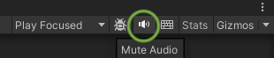

The **Text To Speech (TTS) API** is a simple way to generate very realistic speech audio clips from text.

Please note that [OpenAI's policy](https://openai.com/policies/usage-policies){:target="_blank"} requires you to provide a clear disclosure to end users that the TTS voice they are hearing is AI-generated and not a human voice.
{:.notice--warning}

## Sample Scene

The best way to get started with the _Text To Speech_ is to open the `[Demo] Text To Speech` scene in the `Assets/AiToolbox/Samples/Runtime Usage` folder.

{: .image-fancy }

{:.image-caption}
The `[Demo] Text To Speech` scene

Type the text in the text field, select the [Vioce option](#voice-options) and click the **Process** button. The maximum length is 4096 characters.

If you'd like to stop the processing, click the **Stop** button.

To get the generated audio file, click the **Export** button.

If you don't hear any audio, please make sure your _Mute Audio_ button in the _Game_ panel is not active.
{: .image-simple }
{:.notice--info}

The settings for this scene such as the API key and the voice option can be found on the `TextToSpeechDemo` Game Object in the Hierarchy panel. Please select it and find the settings on the Inspector panel.

{: .image-fancy }

{:.image-caption}
The `[Demo] Text To Speech` scene's settings (`Text To Speech Demo` Component)

## Quick Start

### Request Method

This method is used to request text-to-speech conversion of the input text.

```csharp
public static Action Request(
    string input,
    TextToSpeechParameters parameters,
    Action<AudioClip> completeCallback,
    Action<long, string> failureCallback
)
```

**Parameters:**
- `input`: The input text to convert to speech.
- `parameters`: The parameters for the text-to-speech request.
- `completeCallback`: The callback to be called when the request is completed.
- `failureCallback`: The callback to be called when the request fails.

### CancelAllRequests Method

This method is used to cancel all pending text-to-speech requests.

```csharp
public static void CancelAllRequests()
```


## Voice Options

The Voice Option allows you to select from the [available voices](https://platform.openai.com/docs/guides/text-to-speech/voice-options){:target="_blank"} the one that suits the best for your project. The available voices are: `Alloy`, `Echo`, `Fable`, `Onyx`, `Nova`, and `Shimmer`.

## Pricing

The up-to-date Text-to-speech pricing can be found in the following chart of the [OpenAI Documentation](https://openai.com/pricing#audio-models){:target="_blank"}.

## Having Issues?

If you have any questions or need help with the Moderation functionality in AI Toolbox, please [contact us](/contact-details/).
