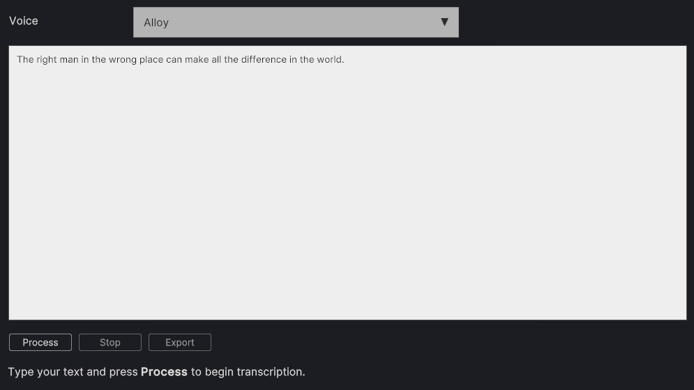
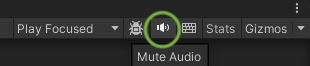

The `ChatGpt` Text To Speech (TTS) API is a simple way to generate speech from text.

Please note that [OpenAI's policy](https://openai.com/policies/usage-policies){:target="_blank"} requires you to provide a clear disclosure to end users that the TTS voice they are hearing is AI-generated and not a human voice.
{:.notice--warning}

## Sample Scene

The best way to get started with the _Text To Speech_ is to open the `[Demo] Text To Speech` scene in the `Assets/AiToolbox/Samples/Runtime Usage` folder.

{: .image-fancy }

{:.image-caption}
The `[Demo] Text To Speech` scene

Type the text in the text field, select the [Vioce option](/tts/#voice-options) and click the **Process** button. The maximum length is 4096 characters.

If you'd like to stop the processing, click the **Stop** button.

To get the generated audio file, click the **Export** button.

If you don't hear any audio, please make sure your _Mute Audio_ button in the _Game_ panel is not active.
{: .image-simple }
{:.notice--info}

## Voice Options

The `Voice` option allows you to select the voice you find suits the best for your project. The available voices are: `Alloy`, `Echo`, `Fable`, `Onyx`, `Nova`, and `Shimmer`.

## Pricing

The up-to-date Text-to-speech pricing can be found in the following chart of the [OpenAI Documentation](https://openai.com/pricing#audio-models){:target="_blank"}.

## Having Issues?

If you have any questions or need help with the Moderation functionality in AI Toolbox, please [contact us](/contact-details/).

