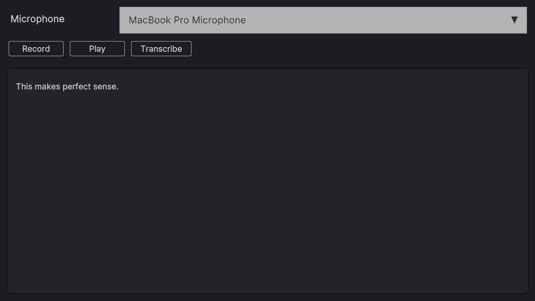
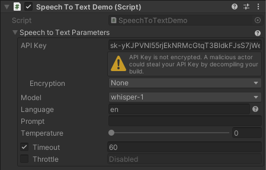

The **Speech-to-text API** does speech recognition and converts spoken words in audio files into written text. Internally, it uses OpenAI [Whisper model](https://openai.com/research/whisper){:target="_blank"}.

## Sample Scene

The best way to get started with the _Text To Speech_ is to open the `[Demo] Speech To Text` scene in the `Assets/AiToolbox/Samples/Runtime Usage` folder.

{: .image-fancy }

{:.image-caption}
The `[Demo] Speech To Text` scene

Select the _Microphone_ input device and click the _Record_ button to start recording. Once you're done, click the _Stop_ button to stop the recording.

To transcribe the text, press the _Transcribe_ button. The generated text will be displayed in the _Transcription_ field.

<!-- To save the transcribed text, please select the _Export_ button. -->

<!-- If you don't hear any audio, please make sure your _Mute Audio_ button in the _Game_ panel is not active.
{: .image-simple }
{:.notice--info} -->

The settings for this scene such as the API key and the voice option can be found on the `Speech To Text` Game Object in the Hierarchy panel. Please select it and find the `Speech To Text Demo` Component on the Inspector panel.

{: .image-fancy }

{:.image-caption}
The `[Demo] Speech To Text` scene's settings (`Speech To Text Demo` Component)

## Quick Start

### Request Method

This method is used to request speech-to-text conversion of the input audio clip.

```csharp
public static Action Request(
    AudioClip audio,
    SpeechToTextParameters parameters,
    Action<SpeechToTextResponse> completeCallback,
    Action<long, string> failureCallback
)
```
**Parameters:**
- `audio`: The input audio clip to convert to text.
- `parameters`: The parameters for the speech-to-text request.
- `completeCallback`: The callback to be called when the request is completed.
- `failureCallback`: The callback to be called when the request fails.

### CancelAllRequests Method

This method is used to cancel all pending speech-to-text requests.

```csharp
public static void CancelAllRequests()
```

## Pricing

The up-to-date Text-to-speech pricing can be found in the following chart of the [OpenAI Documentation](https://openai.com/pricing#audio-models){:target="_blank"}.

## Having Issues?

If you have any questions or need help with the Moderation functionality in AI Toolbox, please [contact us](/contact-details/).
