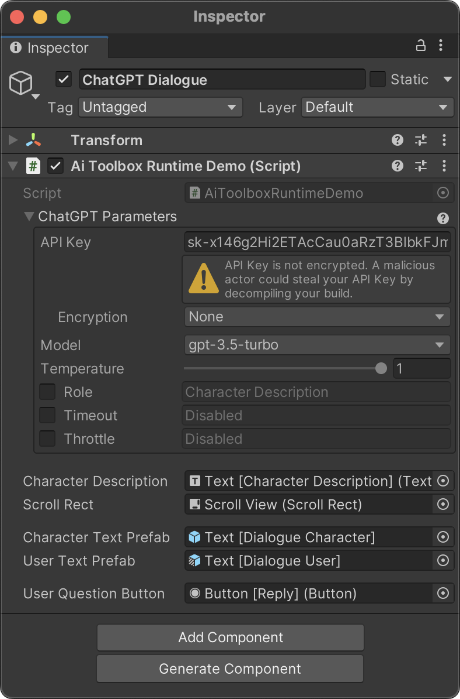

{: .image-simple }

## Overview

The `{{ site.dalle }}` class provides a simple and convenient way to interact with the [{{ site.dalle }} API](https://platform.openai.com/docs/guides/chat){:target="_blank"}. It allows you to send requests to the {{ site.dalle }} API and receive the response either all at once or in chunks as it is generated.

## Sample Scene

The best way to get started with the {{ site.dalle }} API is to open the `[Demo] {{ site.dalle }}` scene in the `Assets/AiToolbox/Samples/Runtime Usage/[Demo] {{ site.dalle }}` folder. This scene demonstrates how to use the `{{ site.dalle }}` class to send requests to the {{ site.dalle }} API and receive the response.

{: .image-fancy }

{:.image-caption}
The `[Demo] {{ site.dalle }}` scene

The API Key, Model, and other settings are exposed in the Inspector panel. More info, please scroll down to the [Parameters Class](#parameters-class) section.

{:.image-fancy width="450px"}

{:.image-caption}
The settings for _AI Toolbox Runtime_ demo scene, Inspector panel

## Quick Start

### Request

Sends a request to {{ site.dalle }} and receives the response. The response is provided in the `completeCallback` function. If the request fails, the `failureCallback` function is called. Depending on the `updateCallback` parameter, the response can be received either all at once or in chunks as it is generated.

This method has two overloads with different first parameter types:

- You can provide one prompt as a `string`. **This is useful for one-off requests.**
- You can provide a sequence of `Message` objects. **This is useful for conversations.**

#### Request with a prompt

```csharp
public static Action Request(string prompt,
                             Parameters parameters,
                             Action<string> completeCallback,
                             Action<long, string> failureCallback,
                             Action<string> updateCallback = null)
```

**Parameters**
- `prompt`: The text of the request, e.g. "Generate a character description". The prompt should be a complete sentence or a paragraph. The API will generate a response based on the prompt.
- `parameters`: Settings of the request, represented by a [`Parameters`](#parameters-class) object.
- `completeCallback`: The function to be called on successful completion. {{ site.dalle }} response is provided as a parameter.
- `failureCallback`: The function to be called on failure. Error code and message are provided as parameters. See [Error Handling](#error-handling) for more information.
- `updateCallback` *(optional)*: The function to be called when a new chunk of the response is generated. The chunk is provided as a parameter. If this parameter is not specified, the response will be received all at once in the `completeCallback` function. This parameter is useful when you want to display the response as it is generated.

**Returns**
- A function that can be called to cancel the request.

#### Request with a sequence of `Messages`

```csharp
public static Action Request(IEnumerable<Message> messages,
                             Parameters parameters,
                             Action<string> completeCallback,
                             Action<long, string> failureCallback,
                             Action<string> updateCallback = null)
```

**Parameters**
- `messages`: A sequence of `Message` objects. Each `Message` object represents a message in the conversation. The `Message` class has two properties: `text` and `role`. The `text` property is the text of the message. The `role` property is an enum with two values: `User` and `AI`. The order of the messages in the sequence is important. The first message in the sequence is the first message in the conversation. The last message in the sequence is the last message in the conversation. The roles of the messages in the sequence alternate between `User` and `AI`. The last message in the sequence must have the `User` role. The `Message` class has a constructor that takes the text and role as parameters. You can use this constructor to create a sequence of `Message` objects. See the [Sample Scene](#sample-scene) for an example.
- `parameters`: Settings of the request, represented by a [`Parameters`](#parameters-class) object.
- `completeCallback`: The function to be called on successful completion. {{ site.dalle }} response is provided as a parameter.
- `failureCallback`: The function to be called on failure. Error code and message are provided as parameters. See [Error Handling](#error-handling) for more information.
- `updateCallback` *(optional)*: The function to be called when a new chunk of the response is generated. The chunk is provided as a parameter. If this parameter is not specified, the response will be received all at once in the `completeCallback` function. This parameter is useful when you want to display the response as it is generated.

**Returns**
- A function that can be called to cancel the request.

### CancelAllRequests

Cancels all pending requests.

```csharp
public static void CancelAllRequests()
```

## Parameters Class

Represents the settings for the AI Toolbox {{ site.dalle }} requests.

The best way to use the `Parameters` class is to expose it as a public field in a `MonoBehaviour` class. This way you can set the parameters in the Unity Inspector.

```csharp
using AiToolbox;
using UnityEngine;

public class {{ site.dalle }}Example : MonoBehaviour {
    public Parameters parameters;
    <...>
}
```

{: .image-fancy }

You can also create a `Parameters` instance is to use one of the constructors. The `Parameters` class also provides a copy constructor that can be used to create a copy of an existing `Parameters` instance.

### Properties

- `apiKey`: The API key for {{ site.dalle }}. This property is required. You can find your API key on the [API Keys](https://platform.openai.com/account/api-keys){:target="_blank"} page.
- `apiKeyEncryption`: The encryption method for the API key. This property is optional. The default value is `ApiKeyEncryption.None`.
- `apiKeyRemoteConfigKey`: The remote configuration key for the API key. This property is required if `apiKeyEncryption` is set to `ApiKeyEncryption.RemoteConfig`. This value is the key of the remote configuration entry in [Unity Remote Config](https://unity.com/products/remote-config){:target="_blank"} that contains the API key.
- `apiKeyEncryptionPassword`: The password used for API key encryption. This property is required if `apiKeyEncryption` is set to `ApiKeyEncryption.Encrypted`. This value is used to encrypt the API key before it is stored in the Unity scene.
- `model`: The {{ site.dalle }} model to use for the request.
- `temperature`: The temperature setting for the request.
- `role`: An optional role for the request. The role is used to specify the persona for the response. The API will generate a response based on the role.
- `timeout`: The timeout for the request, in milliseconds. If the request is not completed within the specified timeout, the request will be cancelled and the failure callback will be called. If no timeout is specified, the request will not be cancelled automatically.
- `throttle`: The maximum number of concurrent requests. If the request is throttled, the request will be cancelled and the failure callback will be called. If no throttle is specified, the request will not be cancelled automatically.

### Constructors

- `Parameters(string apiKey)`: Initializes a new `Parameters` instance with the specified API key.
- `Parameters(Parameters parameters)`: Initializes a new `Parameters` instance by copying the settings from another `Parameters` instance.

## Examples

These examples demonstrate how to send a request to {{ site.dalle }} using the `Request` method.

**To receive the full response at once**, you can omit the `updateCallback` parameter in the `Request` method. The response will be provided in the `completeCallback` function.

**To receive the response gradually as it is generated**, you can provide an `updateCallback` parameter in the `Request` method. The response will be provided in the `updateCallback` function as it is generated. The `completeCallback` function will be called when the response is completed.

The following code example demonstrates how to send request to {{ site.dalle }} and receive the response. The example uses the `Parameters` class to set the API key and other parameters from the Unity Inspector.

```csharp
using AiToolbox;
using UnityEngine;

public class CommonUsageExample : MonoBehaviour {
public Parameters parameters;
public string prompt = "Generate a character description";

void Start() {
    // Check if the API Key is set in the Inspector, just in case.
    if (parameters == null || string.IsNullOrEmpty(parameters.apiKey)) {
        const string errorMessage = "Please set the API Key in the " +
                                    "{{ site.dalle }} Dialogue Game Object.";
        Debug.LogError(errorMessage);
        return;
    }

    // This request provides only `completeCallback` and `failureCallback`
    // parameters. Since the `updateCallback` is not provided, the request
    // will be completed in one step, and the `completeCallback` will be
    // called only once, with the full text of the answer.
    {{ site.dalle }}.Request(prompt, parameters,
                    response => {
                        Debug.Log("Full response: " + response);
                    }, (errorCode, errorMessage) => {
                        var errorType = ({{ site.dalle }}ErrorCodes)errorCode;
                        Debug.LogError("Error: " + errorType + " - " +
                                        errorMessage);
                    });

    // This request provides all three callbacks: `completeCallback`,
    // `updateCallback`, and `failureCallback`. Since the `updateCallback`
    // is provided, the request will be completed in multiple steps, and the
    // `completeCallback` will be called only once, with the full text of
    // the answer.
    {{ site.dalle }}.Request(prompt, parameters,
                    response => {
                        Debug.Log("Full response: " + response);
                    }, (errorCode, errorMessage) => {
                        var errorType = ({{ site.dalle }}ErrorCodes)errorCode;
                        Debug.LogError("Error: " + errorType + " - " +
                                        errorMessage);
                    },
                    chunk => {
                        Debug.Log("Next part of response: " + chunk);
                    });
}

void OnDestroy() {
    {{ site.dalle }}.CancelAllRequests();
}
}
```

### Conversation Example

If you need to facilitate a dialogue between the user and the AI, you can use the `Request` method with a sequence of `Message` objects. The following code example demonstrates how to use the `{{ site.dalle }}` class to send a request to {{ site.dalle }} and receive the response. The example uses the `Parameters` class to set the API key and other parameters from the Unity Inspector.

Please see the [Sample Scene](#sample-scene) for a complete example.

## Error Handling

When using the `AiToolbox.{{ site.dalle }}` class, errors can occur during requests. Errors are handled through the `failureCallback` parameter of the `Request` method. This callback provides an error code and an error message as parameters.

The error codes are represented by the `{{ site.dalle }}ErrorCodes` enum:

### Error Codes

- `MaxTokensExceeded (0)`: The request exceeds the maximum token limit allowed by the API.
- `ThrottleExceeded (1)`: The request rate exceeds the allowed rate limit.
- `RemoteConfigConnectionFailure (2)`: The API failed to connect to the remote configuration server.
- `RemoteConfigKeyNotFound (3)`: The specified remote configuration key for the API key was not found.
- `Unknown (4)`: An unknown error occurred during the request.

Additionally, the error code could be a value of HTTP status code, e.g. 401, 429, 500, etc. You can find the full list of HTTP status codes returned by the {{ site.dalle }} API [here](https://platform.openai.com/docs/guides/error-codes){:target="_blank"}.

### Handling Errors

To handle errors, you can use a switch statement or if-else conditions inside the `failureCallback`. Here's an example:

```csharp
{{ site.dalle }}.Request(
    prompt,
    parameters,
    response => {
        Debug.Log("Response: " + response);
    },
    (errorCode, errorMessage) => {
        {{ site.dalle }}ErrorCodes error = ({{ site.dalle }}ErrorCodes)errorCode;
        Debug.LogError("Error: " + errorCode + " - " + errorMessage);

        switch (error) {
            case {{ site.dalle }}ErrorCodes.MaxTokensExceeded:
                // Handle max tokens exceeded error
                break;
            case {{ site.dalle }}ErrorCodes.ThrottleExceeded:
                // Handle throttle exceeded error
                break;
            case {{ site.dalle }}ErrorCodes.RemoteConfigConnectionFailure:
                // Handle remote config connection failure error
                break;
            case {{ site.dalle }}ErrorCodes.RemoteConfigKeyNotFound:
                // Handle remote config key not found error
                break;
            case {{ site.dalle }}ErrorCodes.Unknown:
                // Handle unknown error
                break;
            default:
                // Handle errors corresponding to HTTP status codes.
                break;
        }
    }
);
```

In this example, different error handling actions can be implemented based on the error code received. The following sections provide guidance on handling each error code:

### MaxTokensExceeded

This error occurs when the request exceeds the maximum token limit allowed by the API. To handle this error, you can:

1. Reduce the length of your prompt, ensuring that it stays within the token limit.
2. If your application allows user input, validate and limit the input length before sending it to the API.

### ThrottleExceeded

This error indicates that the request rate exceeds the allowed rate limit. To handle this error, you can:

1. Implement a request queue or caching system to avoid sending too many requests in a short period.
2. Use the `throttle` property in the [`Parameters`](#parameters-class) class to control the request rate programmatically.

### RemoteConfigConnectionFailure

This error occurs when the API fails to connect to the remote configuration server. To handle this error, you can:

1. Check the internet connection and retry the request if necessary.
2. Verify that the remote configuration server is online and accessible.
3. Provide a fallback mechanism to use a local API key if remote configuration is unavailable.

### RemoteConfigKeyNotFound

This error occurs when the specified remote configuration key for the API key is not found. To handle this error, you can:

1. Ensure that the remote configuration key is correctly specified in the [`Parameters`](#parameters-class) class.
2. Check if the key exists in the remote configuration server.
3. Use a local API key as a fallback if the remote key is not found.

### Unknown

This error indicates that an unknown error occurred during the request. To handle this error, you can:

1. Log the error message for debugging purposes.
2. Implement a retry mechanism with exponential backoff to attempt the request again after a certain amount of time.
3. Provide a user-friendly error message or fallback behavior to maintain a positive user experience.

### HTTP Status Codes

The {{ site.dalle }} API can return different HTTP status codes. You can find the full list of HTTP status codes returned by the {{ site.dalle }} API [here](https://platform.openai.com/docs/guides/error-codes){:target="_blank"}.

## API Key Management

Proper management of the {{ site.dalle }} API key is essential to keep your account secure and prevent unauthorized access. AI Toolbox provides different ways to store the API key in a Unity project, and you should choose the method that best suits your security needs.

### Storing the API Key in a GameObject

You can store the {{ site.dalle }} API key directly in a GameObject by making the [`Parameters`](#parameters-class) a public property. This allows you to set the API key directly in the Unity Inspector. However, if you use the Encryption Option `None` the API key will be stored in plain text, which can expose it to malicious actors.

### Storing the API Key in Unity Remote Config

Another option for storing the API key is using the [Unity Remote Config](https://unity.com/products/remote-config){:target="_blank"}. This allows you to securely manage the API key in the cloud, making it less vulnerable to unauthorized access. To use this method, set the `ApiKeyEncryption` in `Parameters` to `ApiKeyEncryption.RemoteConfig` and provide the corresponding `apiKeyRemoteConfigKey`.

### Encryption Options

The `ApiKeyEncryption` enumeration provides different encryption options for storing the API key:

- `None`: The API key is stored without encryption. This method is not recommended, as it can expose the API key to malicious actors.
- `LocallyEncrypted`: The API key is stored as an encrypted value. To use this method, set the `Encryption` in `Parameters` to `Locally Encrypted`, and provide an `Encryption Password` which can be any string. The API key will be encrypted using the provided password.
- `RemoteConfig`: The API key is stored in the [Unity Remote Config](https://unity.com/products/remote-config){:target="_blank"}. This method is recommended for improved security and flexibility. Set the `Encryption` in `Parameters` to `RemoteConfig`, and provide the corresponding `RemoteConfig Key`.

If you have any questions or need help with the {{ site.dalle }} API, please [contact us](/contact-details/).
