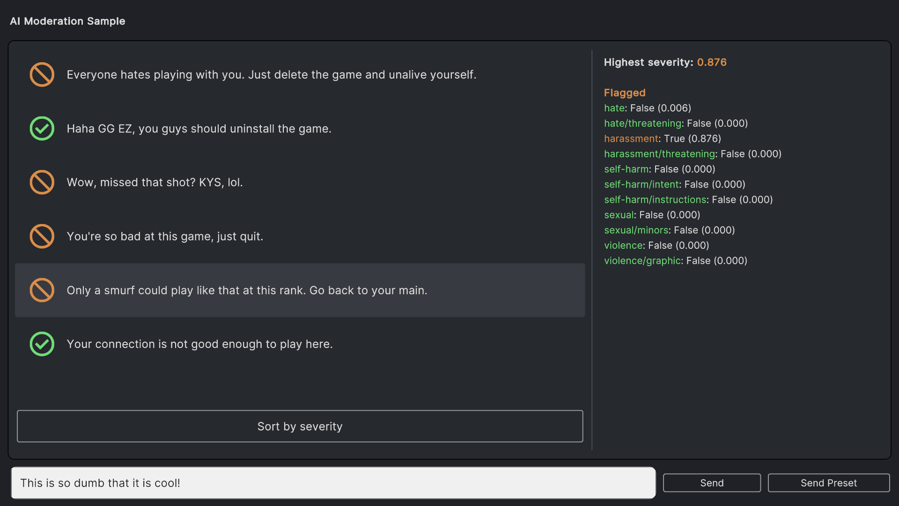

## Overview

AI Moderation is a service that uses machine learning to detect and filter inappropriate content in text. It can be used to moderate user-generated content, such as comments, nicknames, and messages, to ensure that it complies with community guidelines and legal requirements.

Using a pre-compiled vocabulary is great for filtering the offensive content, but it's not enough. The AI Moderation service is a great addition to the ChatGPT API, as it can help to filter out the inappropriate content that is not in the vocabulary. Especially, AI detects the offensive context even if there are no offending, hate or slur words used.

## Categories

The denominators under which the filtered content is categorized are as follows:

| Category | Description |
| --- | --- |
| `hate` | Content that expresses, incites, or promotes hate based on race, gender, ethnicity, religion, nationality, sexual orientation, disability status, or caste. Hateful content aimed at non-protected groups (e.g., chess players) is harrassment. |
| `hate/threatening` | Hateful content that also includes violence or serious harm towards the targeted group based on race, gender, ethnicity, religion, nationality, sexual orientation, disability status, or caste. |
| `harassment` | Content that expresses, incites, or promotes harassing language towards any target. |
| `harassment/threatening` | Harassment content that also includes violence or serious harm towards any target. |
| `self-harm` | Content that promotes, encourages, or depicts acts of self-harm, such as suicide, cutting, and eating disorders. |
| `self-harm/intent` | Content where the speaker expresses that they are engaging or intend to engage in acts of self-harm, such as suicide, cutting, and eating disorders. |
| `self-harm/instructions` | Content that encourages performing acts of self-harm, such as suicide, cutting, and eating disorders, or that gives instructions or advice on how to commit such acts. |
| `sexual` | CContent meant to arouse sexual excitement, such as the description of sexual activity, or that promotes sexual services (excluding sex education and wellness). |
| `sexual/minors` | Sexual content that includes an individual who is under 18 years old. |
| `violence` | Content that depicts death, violence, or physical injury. |
| `violence/graphic` | Content that depicts death, violence, or physical injury in graphic detail. |

In the [AI Moderation Chat Demo Scene](/#ai-moderation-chat-demo-scene) the triggered categories are highlighted. 

For more information on the moderation please refer to the [OpenAI documentation](https://platform.openai.com/docs/guides/moderation){:target="_blank"}.

## AI Moderation Chat Demo Scene

We included the demo scene that shows the moderation in action using a chatbox. You can type in your phrases to get verified or send pre-saved ones. To start the demo, please press Play.

{:.image-rounded}

AI Moderation Chat Demo Scene
{:.image-caption}

## Having Issues?

If you have any questions or need help with the Moderation functionality in AI Toolbox, please [contact us](/contact-details/).
